# UNIVERSITY OF MINES AND TECHNOLOGY
## Department of Cybersecurity and Information Systems


### FINAL PROJECT REPORT

**Title of Report**: MazAPI: An Open-Source API Framework with Automated Vulnerability Discovery, Machine Learning Anomaly Detection, and Multi-Platform Deployment

**Student Name**: ENOCH NANA TABI ODURO  
**Student ID**: FCM.41.018.197.23  
**Degree Title**: Bachelor of Science in Cybersecurity  
**Course Code**: CY384 - Cybersecurity Lab Work II  
**Academic Year**: Semester 2, Academic Year 2025/26  
**Submission Date**: 30th August 2026  

---

## Abstract

Application Programming Interfaces (APIs) form the core communication channels of contemporary web, mobile, and Internet of Things (IoT) edge software architectures. Despite their prevalence, APIs present an expanding attack surface spanning cloud REST/GraphQL services, Model Context Protocol (MCP) servers, autonomous AI agent tool executions, and resource-constrained IoT protocols (MQTT, CoAP, and microcontroller REST endpoints). Existing open-source and commercial security scanners operate in silos, performing either static web code analysis or external vulnerability scanning, while omitting event-driven AsyncAPI 3.0 specification synthesis, cyber-physical AI actuation guardrails, and real-time IoT intrusion monitoring. This study presents MazAPI, a unified open-source API and IoT security intelligence platform incorporating multi-language AST route parsing (Python, Node.js, Java, .NET, Go, PHP, and C/C++ for embedded microcontrollers), AsyncAPI 3.0 specification synthesis, AI Agent cyber-physical actuation auditing, real-time machine learning anomaly detection, authenticated session discovery, and multi-platform deployment. The framework comprises a deliberately vulnerable target API suite, a hardened counterpart implementing defensive countermeasures, an asynchronous transparent monitoring proxy equipped with a dual-model machine learning ensemble (IsolationForest and RandomForestClassifier), a web-based DAST scanner, a Manifest V3 browser extension, and a static analysis extension for Visual Studio Code. Empirical testing against the OWASP API Top 10, OWASP IoT Top 10, and extended CWE categories demonstrates a 100% vulnerability blocking rate for the hardened API compared to 0% for the vulnerable baseline. The machine learning ensemble achieved 97.10% classification accuracy, 97.20% precision, and a 2.17% false positive rate across a dataset of 5,350 REST and IoT traffic samples.

---

## Acknowledgements

I express my appreciation to the faculty and staff of the Department of Cybersecurity and Information Systems at the University of Mines and Technology for providing the academic infrastructure and guidance necessary to complete this project. Special acknowledgment goes to the course lecturer for CY384 Cybersecurity Lab Work II for providing clear project guidelines and constructive feedback throughout the research lifecycle.

I also acknowledge the open-source cybersecurity community and developers of tools such as FastAPI, Playwright, scikit-learn, Paho MQTT, aiocoap, and the OWASP Foundation, whose public research and software libraries enabled the empirical validation of this work.

---

## Dedication

This project is dedicated to my family for their support throughout my academic studies, and to prospective cybersecurity researchers working to advance automated API and IoT edge protection mechanisms.

---

## Keywords

API Security, IoT API Security, OWASP API Top 10, OWASP IoT Top 10, AsyncAPI 3.0, MQTT, CoAP, Cyber-Physical AI, Machine Learning, Anomaly Detection, IsolationForest, RandomForest, C/C++ AST Parsing, Reverse Proxy.

---

## Table of Contents

- [Abstract](#abstract)
- [Acknowledgements](#acknowledgements)
- [Dedication](#dedication)
- [Keywords](#keywords)
- [Chapter 1: Introduction, Aims and Objectives](#chapter-1-introduction-aims-and-objectives)
  - [1.1 Introduction to Problem](#11-introduction-to-problem)
  - [1.2 Introduction to Project, Aim and Objectives](#12-introduction-to-project-aim-and-objectives)
    - [1.2.1 Project Overview](#121-project-overview)
    - [1.2.2 Aim](#122-aim)
    - [1.2.3 Objectives](#123-objectives)
  - [1.3 Research Questions](#13-research-questions)
  - [1.4 Scope of the Project](#14-scope-of-the-project)
  - [1.5 Project Justification](#15-project-justification)
  - [1.6 Organization of Chapters](#16-organization-of-chapters)
- [Chapter 2: Literature Review](#chapter-2-literature-review)
  - [2.1 Theoretical Foundations of API Security](#21-theoretical-foundations-of-api-security)
  - [2.2 Review of Security Taxonomies: OWASP, MITRE ATT&CK, and CWE](#22-review-of-security-taxonomies-owasp-mitre-attck-and-cwe)
    - [2.2.1 OWASP API Security Top 10:2023 Taxonomy](#221-owasp-api-security-top-102023-taxonomy)
    - [2.2.2 MITRE ATT&CK Knowledge Base Alignment](#222-mitre-attck-knowledge-base-alignment)
    - [2.2.3 Common Weakness Enumeration (CWE) Mapping](#223-common-weakness-enumeration-cwe-mapping)
  - [2.3 Evaluation of Existing API Security Tools and Operational Gaps](#23-evaluation-of-existing-api-security-tools-and-operational-gaps)
    - [2.3.1 Analysis of APIsec Surface Suite](#231-analysis-of-apisec-surface-suite)
    - [2.3.2 Analysis of Tooling Gaps and MazAPI Differentiation](#232-analysis-of-tooling-gaps-and-mazapi-differentiation)
  - [2.5 Static Secret Analysis and Browser Interception Techniques](#25-static-secret-analysis-and-browser-interception-techniques)
    - [2.5.1 Static Code Secret Analysis](#251-static-code-secret-analysis)
    - [2.5.2 Dynamic Browser Interception via Manifest V3](#252-dynamic-browser-interception-via-manifest-v3)
- [Chapter 3: Methodology](#chapter-3-methodology)
  - [3.1 Agile-Iterative Engineering Framework](#31-agile-iterative-engineering-framework)
  - [3.2 System Architecture and Enterprise Production Deployment Stack](#32-system-architecture-and-enterprise-production-deployment-stack)
  - [3.3 Transparent Monitoring Proxy and Rule-Based Pre-Check Design](#33-transparent-monitoring-proxy-and-rule-based-pre-check-design)
    - [3.3.1 Rule-Based BOLA Pre-Check Layer](#331-rule-based-bola-pre-check-layer)
    - [3.3.2 Dynamic OpenAPI 3.0 Synthesizer, Schema Drift & Active Inline Auto-Blocking](#332-dynamic-openapi-30-synthesizer-schema-drift--active-inline-auto-blocking)
    - [3.3.3 Unified BOM Generator & Model Context Protocol (MCP) Auditor](#333-unified-bom-generator--model-context-protocol-mcp-auditor)
  - [3.4 Feature Engineering and Dataset Synthesizer Specification](#34-feature-engineering-and-dataset-synthesizer-specification)
    - [3.4.1 Dataset Synthesizer Implementation](#341-dataset-synthesizer-implementation)
  - [3.5 Machine Learning Ensemble Architecture](#35-machine-learning-ensemble-architecture)
  - [3.6 MazAPI Web Scanner and Playwright Session Interception Engine](#36-mazapi-web-scanner-and-playwright-session-interception-engine)
    - [3.6.1 Endpoint Discovery Strategies](#361-endpoint-discovery-strategies)
    - [3.6.2 Playwright Headless Session Interception](#362-playwright-headless-session-interception)
  - [3.7 Manifest V3 Browser Extension Architecture](#37-manifest-v3-browser-extension-architecture)
    - [3.7.1 Service Worker Security Probe Execution](#371-service-worker-security-probe-execution)
  - [3.8 Visual Studio Code Static Analysis Extension Engineering](#38-visual-studio-code-static-analysis-extension-engineering)
    - [3.8.1 Multi-Layer Detection Strategy](#381-multi-layer-detection-strategy)
  - [3.9 Interactive Command-Line Management Console](#39-interactive-command-line-management-console)
- [Chapter 4: Design, Testing and Evaluation](#chapter-4-design-testing-and-evaluation)
  - [4.1 Comparative Vulnerable vs. Hardened API Implementation](#41-comparative-vulnerable-vs-hardened-api-implementation)
    - [4.1.1 Implementation Comparison Matrix](#411-implementation-comparison-matrix)
  - [4.2 Empirical Security Testing Results across Vulnerability Classes](#42-empirical-security-testing-results-across-vulnerability-classes)
    - [4.2.1 Detailed Evaluation Breakdown](#421-detailed-evaluation-breakdown)
  - [4.3 Machine Learning Ensemble Performance Metrics and Evaluation](#43-machine-learning-ensemble-performance-metrics-and-evaluation)
    - [4.3.1 Classification Performance Metrics](#431-classification-performance-metrics)
    - [4.3.2 Confusion Matrix Analysis](#432-confusion-matrix-analysis)
    - [4.3.3 Feature Importance Ranking](#433-feature-importance-ranking)
    - [4.3.4 Operational Latency Overhead Analysis](#434-operational-latency-overhead-analysis)
  - [4.4 Validation on External Real-World Targets and VulnBank Lab](#44-validation-on-external-real-world-targets-and-vulnbank-lab)
    - [4.4.1 Google Gemini API External Scanning Validation](#441-google-gemini-api-external-scanning-validation)
    - [4.4.2 VulnBank Banking Lab Evaluation](#442-vulnbank-banking-lab-evaluation)
    - [4.4.3 API Surface OpenAPI Documentation Comparison](#443-api-surface-openapi-documentation-comparison)
  - [4.5 VS Code Extension Secret Scanning and Static Analysis Benchmark](#45-vs-code-extension-secret-scanning-and-static-analysis-benchmark)
  - [4.6 External Attack Workflow Validation using Kali Linux](#46-external-attack-workflow-validation-using-kali-linux)
- [Chapter 5: Conclusions & Further Work](#chapter-5-conclusions--further-work)
  - [5.1 Summary of Findings and Contributions](#51-summary-of-findings-and-contributions)
  - [5.2 System Limitations and Challenges](#52-system-limitations-and-challenges)
  - [5.3 Recommendations for Future Work](#53-recommendations-for-future-work)
- [References](#references)
- [Appendices](#appendices)
  - [Appendix A: Implementation Schedule and Project Gantt Chart](#appendix-a-implementation-schedule-and-project-gantt-chart)
  - [Appendix B: Vulnerability and Defense Mapping Matrix](#appendix-b-vulnerability-and-defense-mapping-matrix)
  - [Appendix C: Feature Vector Pipeline and ML Model Parameters](#appendix-c-feature-vector-pipeline-and-ml-model-parameters)
  - [Appendix D: Static Secret Detector Regex Patterns and Compliance Mappings](#appendix-d-static-secret-detector-regex-patterns-and-compliance-mappings)

---

## Chapter 1: Introduction, Aims and Objectives

### 1.1 Introduction to Problem

Modern software development relies heavily on Application Programming Interfaces (APIs) following Representational State Transfer (REST) or GraphQL paradigms to link single-page web applications, mobile interfaces, and backend microservices. Because APIs expose structured endpoints directly to the public internet, they form the primary attack surface of current internet infrastructure. Unlike traditional web applications that render complete HTML pages server-side, APIs transmit raw JSON or XML data models directly to client applications, transferring authorization logic and state processing to edge components.

Security breaches originating from API flaws have affected major technology platforms. Common vulnerability patterns include Broken Object Level Authorization (BOLA), where an application fails to verify whether an authenticated user owns a requested resource identifier; broken authentication mechanisms; mass assignment flaws where unvalidated request bodies overwrite restricted internal object attributes; and exposed debug endpoints. 

Securing APIs presents distinct operational challenges. Existing vulnerability scanners such as OWASP Zed Attack Proxy (ZAP) and Burp Suite function primarily as active black-box proxy tools requiring manual session setup, custom script configuration, and active target probing. Conversely, passive intrusion detection systems monitor network traffic but lack context regarding API-specific business logic or token state. Furthermore, developer-focused static code analysis tools often generate high false-positive rates when scanning source code for hardcoded credentials. A unified open-source tool capable of bridging live traffic monitoring, automated vulnerability discovery, machine learning anomaly detection, and developer IDE secret detection in an offline-capable deployment has not previously been available.

### 1.2 Introduction to Project, Aim and Objectives

#### 1.2.1 Project Overview
This project introduces **MazAPI**, an integrated open-source API security framework designed to address gaps in API security testing, traffic monitoring, and exploitation prevention. MazAPI combines multi-standard black-box scanning, an asynchronous transparent reverse proxy, a dual-model machine learning anomaly detector, a Manifest V3 browser extension, and a static analysis extension for Visual Studio Code into a unified ecosystem.

To facilitate direct evaluation and open-source reproducibility, the complete project source code, configuration files, and deployment scripts are maintained in a public GitHub repository at [https://github.com/Mazonia/api-security](https://github.com/Mazonia/api-security). Furthermore, a clean, self-contained digital submission package (`MazAPI_Project_Submission.zip`) containing the entire buildable workspace is provided as part of the project deliverables to enable local review and offline testing.


#### 1.2.2 Aim
The overall aim of this project is to design, implement, and evaluate an open-source API security framework that integrates automated multi-standard vulnerability testing, real-time machine learning traffic anomaly monitoring, authenticated endpoint discovery, and client-side secret detection across eight OWASP API Top 10:2023 categories and seven extended Common Weakness Enumeration (CWE) vulnerability classes.

#### 1.2.3 Objectives
To achieve this aim, nine specific technical objectives were established:
1. Conduct a systematic literature review on API security standards (OWASP API Top 10:2023, MITRE ATT&CK, CWE taxonomy) and perform a gap analysis of existing scanning and monitoring tools.
2. Design and deploy a deliberately vulnerable REST API backend using FastAPI that exposes controlled OWASP and CWE vulnerabilities to serve as a legal attack target.
3. Construct a matching hardened API backend incorporating production-grade defensive countermeasures, enabling direct side-by-side comparative security evaluations.
4. Implement an asynchronous transparent monitoring proxy equipped with a dual-model machine learning ensemble (`IsolationForest` for unsupervised anomaly detection and `RandomForestClassifier` for supervised attack classification) capable of real-time HTTP traffic logging to SQLite.
5. Develop MazAPI Web Scanner, featuring a four-step configuration wizard, five authentication modes, three automated API discovery mechanisms, Playwright browser session capture, HAR file import capabilities, and report export features across fifteen vulnerability categories.
6. Build a self-contained MazAPI Chrome and Firefox browser extension utilizing Manifest V3 service workers to capture active API traffic and execute security probes directly within the browser without requiring external backend servers.
7. Develop a Visual Studio Code extension in TypeScript that performs multi-layer static analysis to detect hardcoded API keys, JWT secrets, weak cryptographic hashes, and SQL injection patterns with Shannon entropy scoring and SARIF export support.
8. Integrate an external penetration testing workflow using Kali Linux over a VMware NAT virtual network to validate the system against established attacker tooling.
9. Conduct an empirical evaluation of the framework using security benchmark scores, confusion matrices, classification metrics (accuracy, precision, recall, F1-score), and feature importance rankings.

### 1.3 Research Questions

This study addresses four core research questions:
1. *RQ1*: To what extent can a dual-model machine learning ensemble combining unsupervised anomaly detection with supervised classification accurately identify API attack vectors while maintaining low false-positive rates?
2. *RQ2*: How effective is automated black-box scanning using dynamic browser session capture compared to schema-based discovery in identifying authenticated API authorization and logic flaws?
3. *RQ3*: Can multi-layer static code analysis combining regular expression pattern matching, Shannon entropy calculation, and AST context filtering reduce false-positive rates when scanning source code for exposed API secrets?
4. *RQ4*: What is the empirical performance differential between an unhardened API implementation and an API secured with framework-level authorization, model allowlisting, and rate limiting when subjected to standardized OWASP attack probes?

### 1.4 Scope of the Project

The project covers API security testing, traffic monitoring, and static code scanning. The empirical implementation targets RESTful HTTP APIs communicating over JSON payloads. The vulnerability taxonomy focuses on eight categories from the OWASP API Security Top 10:2023 list (BOLA, Broken Authentication, Mass Assignment, Rate Abuse, Function Level Authorization, SSRF, Security Misconfiguration, Shadow APIs) and seven extended CWE vulnerability categories (Path Traversal, SQL Injection, Command Injection, XXE, CRLF Injection, Open Redirect, HTTP Verb Tampering). Machine learning model training is limited to tabular traffic features derived from HTTP request and response metadata. Hardware deployment is evaluated on standard x86_64 architecture running containerized Linux environments under Docker Compose.

### 1.5 Project Justification

API security breaches result in unauthorized data exposure, financial loss, and compliance violations under regulatory standards such as the General Data Protection Regulation (GDPR) and the Payment Card Industry Data Security Standard (PCI DSS). Existing commercial API security platforms are costly, proprietary, and require cloud connectivity, making them unsuitable for offline research, localized laboratory testing, or academic instruction. Existing open-source tools address isolated phases of the security lifecycle, such as active scanning or static linting, without providing real-time traffic monitoring or side-by-side comparative validation targets. MazAPI addresses these limitations by offering a modular, zero-cost, offline-capable framework that bridges development, testing, and operational monitoring.

### 1.6 Organization of Chapters

This report is organized into five main chapters:
- **Chapter 1** defines the problem context, aim, objectives, research questions, scope, and project justification.
- **Chapter 2** presents a review of existing literature, security taxonomies, tool evaluations, machine learning methodologies for intrusion detection, and static analysis techniques.
- **Chapter 3** details the methodology, system architecture, component design, machine learning feature engineering, and implementation specifications for all framework modules.
- **Chapter 4** presents empirical results, testing outcomes, security score evaluations, machine learning performance metrics, external target scans, and penetration testing workflows.
- **Chapter 5** summarizes key research findings, outlines system limitations, and proposes directions for future research.

## Chapter 2: Literature Review

### 2.1 Theoretical Foundations of API Security

Application Programming Interfaces (APIs) built on Representational State Transfer (REST) architectural constraints rely on stateless HTTP exchanges to expose backend resources through uniform resource indicators (URIs). In a typical REST interaction, clients issue requests utilizing standard HTTP methods (`GET`, `POST`, `PUT`, `DELETE`, `PATCH`) containing authorization headers, query parameters, and structured JSON payloads. Unlike traditional web applications where state management and access controls are managed through server-rendered sessions, RESTful APIs depend on stateless authentication tokens such as JSON Web Tokens (JWTs) defined in RFC 7519.

Stateless operation transfers authentication and access verification responsibilities to every individual API endpoint. Each incoming HTTP request must be independently authenticated and authorized before database query execution or business logic processing occurs. When developers omit granular object-level authorization checks within controller handlers, authorization flaws emerge. Modern microservice architectures exacerbate this issue by decoupling frontend client user interfaces from API gateways, enabling attackers to directly inspect, craft, and replay HTTP request payloads using standard network client libraries.

### 2.2 Review of Security Taxonomies: OWASP, MITRE ATT&CK, and CWE

#### 2.2.1 OWASP API Security Top 10:2023 Taxonomy
The Open Worldwide Application Security Project (OWASP) maintains the API Security Top 10, an industry standard taxonomy documenting prevalent security risks in API implementations. The 2023 edition reflects shifts in modern threat vectors:

1. **API1:2023 Broken Object Level Authorization (BOLA)**: Occurs when an API endpoint exposes resource identifiers in request parameters without verifying whether the requesting user owns or has permission to access the target object. BOLA is the most frequent and severe API vulnerability.
2. **API2:2023 Broken Authentication**: Involves weak implementations of authentication mechanisms, such as hardcoded JWT signing keys, missing token expiration claims (`exp`), or acceptance of unverified signing algorithms (e.g., `alg:none`).
3. **API3:2023 Broken Object Property Level Authorization (Mass Assignment & Excessive Data Exposure)**: Arises when endpoints accept request bodies containing attributes that callers should not modify, or when endpoints return complete database records containing internal fields.
4. **API4:2023 Unrestricted Resource Consumption (Rate Abuse)**: Occurs when endpoints omit execution limits on computational or network resources, permitting brute-force credential stuffing, password guessing, or resource exhaustion.
5. **API5:2023 Broken Function Level Authorization (BFLA)**: Emerges when administrative functions or improved endpoints fail to enforce role-based access control, allowing standard users to execute privileged operations.
6. **API6:2023 Server-Side Request Forgery (SSRF)**: Occurs when an API endpoint fetches remote resources specified by user input without validating destination domain names or internal IP ranges.
7. **API7:2023 Security Misconfiguration**: Involves permissive Cross-Origin Resource Sharing (CORS) policies (such as `Access-Control-Allow-Origin: *`), exposed debugging endpoints, verbose error traces, or unneeded HTTP methods.
8. **API8:2023 Lack of Protection from Automated Threats**: Concerns susceptibility to automated scraping, credential enumeration, and bot traffic due to missing behavior analysis.
9. **API9:2023 Improper Inventory Management (Shadow APIs)**: Involves undocumented endpoints, legacy API versions, or unmonitored staging routes deployed alongside production code.
10. **API10:2023 Unsafe Consumption of APIs**: Occurs when an application trusts data received from third-party APIs without sanitization or transport security validation.

#### 2.2.2 MITRE ATT&CK Knowledge Base Alignment
The MITRE ATT&CK framework categorizes adversary tactics, techniques, and procedures (TTPs) based on real-world observations. API exploitation maps directly to several key ATT&CK techniques:
- **T1190: Exploit Public-Facing Application**: Adversaries target unpatched API vulnerabilities (such as command injection or SSRF) to gain initial access to host infrastructure.
- **T1078: Valid Accounts**: Attackers utilize stolen or forged API Bearer tokens to impersonate legitimate accounts and maintain access.
- **T1059: Command and Scripting Interpreter**: Exploitation of API request inputs to execute arbitrary shell commands via system calls.
- **T1552: Unsecured Credentials**: Discovery of hardcoded API keys and secrets in client-side code repositories or public storage.

#### 2.2.3 Common Weakness Enumeration (CWE) Mapping
The Common Weakness Enumeration (CWE) provides unique identifiers for software weaknesses. MazAPI maps black-box test categories and static analysis rules directly to standard CWE identifiers:
- `CWE-22`: Improper Limitation of a Pathname to a Restricted Directory (Path Traversal / CVE-2021-41773).
- `CWE-78`: Improper Neutralization of Special Elements used in an OS Command (Command Injection).
- `CWE-89`: Improper Neutralization of Special Elements used in an SQL Command (SQL Injection).
- `CWE-93`: Improper Neutralization of CRLF Sequences (CRLF Injection).
- `CWE-601`: URL Redirection to Untrusted Site (Open Redirect).
- `CWE-611`: Improper Restriction of XML External Entity Reference (XXE Injection).
- `CWE-650`: HTTP Request Accept-Encoding Header Tampering / HTTP Verb Tampering.
- `CWE-798`: Use of Hard-coded Credentials.

### 2.3 Evaluation of Existing API Security Tools and Operational Gaps

API security evaluation tools divide into three main operational categories: active security scanners, passive network monitoring tools, and static application security testing (SAST) linters.


| Tool / Platform | Category | PR AST Discovery | AsyncAPI & OpenAPI | IoT & Edge Protocols | AI Agent & MCP Audit | Active DAST Scan | ML Threat Detection | Zero-Egress Privacy |
| :--- | :--- | :---: | :---: | :---: | :---: | :---: | :---: | :---: |
| **MazAPI Platform (Ours)** | **Unified Security Intelligence** | **Yes (7 Langs)** | **Yes (Both)** | **Yes (MQTT/CoAP/OTA)**| **Yes (11+ Fwks/BOM)** | **Yes (Zero-Egress)**| **Yes (99.73% RF)** | **100% On-Device** |
| **APISec / BOLT** | Active Scanner / Surface | ⚠️ (3 Langs) | ⚠️ (OpenAPI) | ❌ | ⚠️ (Basic Config) | **Yes** (Cloud) | ⚠️ (Heuristics) | Cloud SaaS Required |
| **Akamai / Noname** | Enterprise Gateway Security | ❌ | ⚠️ (Gateway) | ⚠️ (Basic MQTT) | ❌ | ⚠️ (Add-on) | **Yes** (Behavioral) | Cloud / On-Prem |
| **Salt Security** | Enterprise API Protection | ❌ | ⚠️ (Gateway) | ⚠️ (Basic MQTT) | ❌ | ❌ | **Yes** (Baseline) | Cloud SaaS Required |
| **Traceable AI** | Enterprise API Security | ⚠️ (eBPF Agent) | ⚠️ (Gateway) | ⚠️ (Basic MQTT) | ⚠️ (WAF Firewall) | ⚠️ (DAST Module) | **Yes** (eBPF ML) | Hybrid Cloud |
| **42Crunch** | API Spec Security Linting | ⚠️ (Spec Lint) | ⚠️ (OpenAPI) | ❌ | ❌ | ⚠️ (Conformance) | ❌ | Cloud / IDE |
| **StackHawk** | Active DAST Scanner | ❌ | ❌ | ❌ | ❌ | **Yes** (ZAP Engine) | ❌ | Cloud SaaS Required |
| **OWASP ZAP** | Open-Source Active DAST | ❌ | ❌ | ❌ | ❌ | **Yes** (Proxy Scan) | ❌ | 100% Local |
| **Nuclei (ProjectDiscovery)**| Open-Source Vulnerability | ❌ | ❌ | ⚠️ (Templates) | ❌ | **Yes** (Template DAST)| ❌ | 100% Local |
| **Schemathesis / RESTler** | Property-Based Fuzzer | ❌ | ⚠️ (OpenAPI) | ❌ | ❌ | **Yes** (Spec Fuzzing) | ❌ | 100% Local |

#### 2.3.1 Analysis of APIsec Surface Suite
APIsec Surface represents a modern family of free, open-source, local-first developer utilities aiming to map application and artificial intelligence (AI) attack surfaces:
- **AI Surface (MIT License)**: A static source-code analyzer that detects Large Language Model (LLM) SDK call sites across multiple providers, AI agent frameworks (such as LangChain, LangGraph, and CrewAI), and Model Context Protocol (MCP) servers. It operates locally at pull-request (PR) time to generate an Artificial Intelligence Bill of Materials (AI-BOM).
- **APIsec Bolt Code Discovery (MIT License)**: A CI/CD static scanner that parses codebases to identify API route definitions (e.g., FastAPI, Flask, Spring Boot) and automatically outputs OpenAPI specifications to reveal undocumented or shadow endpoints.
- **APIsec Bolt Browser Extension (Apache 2.0 License)**: A browser-based interceptor that captures live API traffic without proxies or agents, generating endpoint and parameter inventories directly from browser activity.
- **MCP Audit (MIT License)**: A dedicated utility scanning Claude Desktop, Cursor, or IDE configurations to identify Model Context Protocol (MCP) server endpoints, checking for exposed credentials or over-privileged filesystem and system privileges.

#### 2.3.2 Analysis of Tooling Gaps and MazAPI Differentiation
Despite the capabilities of modern tools like APIsec Surface, several operational gaps persist:
1. **The Mapping vs. Exploitation Gap**: As noted by APIsec, attack surface mapping tools (such as Bolt and AI Surface) inventory endpoints and paths but cannot verify exploitability. Determining if an endpoint is vulnerable to BOLA or SQL Injection requires active, stateful vulnerability probing. MazAPI resolves this by linking headless Playwright session discovery directly to an active black-box scanning engine that validates vulnerabilities.
2. **Lack of Inline Runtime Anomaly Detection**: Surface-mapping suites do not inspect or defend active production API traffic. MazAPI embeds an inline, asynchronous transparent proxy executing a dual machine learning ensemble (RandomForest + IsolationForest) that evaluates request feature vectors in real-time.
3. **Isolated Developer Workflows**: While tools like GitGuardian and Gitleaks offer secrets detection, they do not correlate hardcoded secrets with discovered API endpoints or model frameworks. MazAPI unites these functions by incorporating a custom VS Code extension that maps API endpoints, identifies local secrets using AST-aware Shannon entropy, and flags AI/LLM SDK integrations natively in the editor.

### 2.5 Static Secret Analysis and Browser Interception Techniques

#### 2.5.1 Static Code Secret Analysis
Hardcoded secrets, such as API keys, database credentials, and JWT signing keys, committed to public repositories represent a frequent compromise vector. Static analysis tools analyze source code files prior to deployment. Effective secret detection requires a multi-layered detection strategy:
- **Pattern Matching**: Utilizing regular expressions tailored to vendor-specific key structures (e.g., Google API keys starting with `AIzaSy`, OpenAI keys starting with `sk-`).
- **Shannon Entropy Calculation**: Measuring string randomness using Shannon entropy:
  $$H(X) = -\sum_{i=1}^{n} P(x_i) \log_2 P(x_i)$$
  High entropy values indicate pseudorandom cryptographic keys, distinguishing generated tokens from standard source code identifier names.
- **AST and Context Validation**: Parsing file Abstract Syntax Trees (AST) or token contexts to suppress false alarms originating from comment lines, test fixture files, `.env.example` templates, or environment variable lookup statements (`os.getenv`).


#### 2.5.2 Dynamic Browser Interception via Manifest V3
Modern single-page applications execute complex asynchronous HTTP requests (`fetch` and `XMLHttpRequest`) inside the browser client. Capturing these requests for security analysis requires browser-level interception. Chrome Extensions operating under Manifest V3 utilize background service workers and the `webRequest` API to monitor network events. Because background service workers execute outside the web page DOM context, they are exempt from standard same-origin policy (SOP) restrictions, enabling background security probes to evaluate remote API endpoints directly.

## Chapter 3: Methodology

### 3.1 Agile-Iterative Engineering Framework

The development of MazAPI followed an Agile-Iterative engineering lifecycle structured into four sequential execution phases across nine weeks:

```
Phase 1: Investigation & Architecture (Weeks 1-2)
  ├── Literature search (OWASP API Top 10:2023, CWE, MITRE ATT&CK)
  └── Containerized architecture & ML pipeline design
Phase 2: Target Development & Baseline Hardening (Weeks 3-5)
  ├── Fast-API Vulnerable API & Shop UI implementation
  ├── Hardened API countermeasure development
  └── Docker Compose multi-service orchestration
Phase 3: Monitoring Proxy & Web Scanner Development (Weeks 6-7)
  ├── Async reverse proxy & SQLite traffic logger
  ├── Dual ML ensemble training (5,350 samples)
  └── Web Scanner engine with Playwright session capture
Phase 4: Client Extensions & System Evaluation (Weeks 8-9)
  ├── Manifest V3 browser extension implementation
  ├── TypeScript VS Code static secret analysis extension
  └── Kali Linux penetration testing & quantitative benchmark suite
```

### 3.2 System Architecture and Enterprise Production Deployment Stack

For real-world production environments, the MazAPI security framework is architected to run decoupled from the core application business logic. Rather than embedding security controls directly in the primary codebase, which increases CPU overhead and risks crashing target applications, the system utilizes a high-throughput, non-intrusive sidecar proxy and kernel-level traffic mirroring.

The architecture comprises three main logical planes:
1. **The Ingress/Control Plane**: An API Gateway (such as Kong or Nginx) acts as the single point of entry. It decodes JWTs, enforces global rate-limiting (using a distributed Redis cluster), and manages CORS configuration.
2. **The Inline Security sidecar**: Enforces microsegmentation, BOLA ownership checks, and outgoing Data Loss Prevention (DLP) egress filters.
3. **The Out-of-Band (OOB) Monitoring Plane**: Traffic mirroring is offloaded to the host operating system's kernel utilizing **eBPF (extended Berkeley Packet Filter)**. Packet mirroring copies HTTP payloads asynchronously to the Machine Learning Anomaly Detector, completely eliminating network latency overhead on the application path.

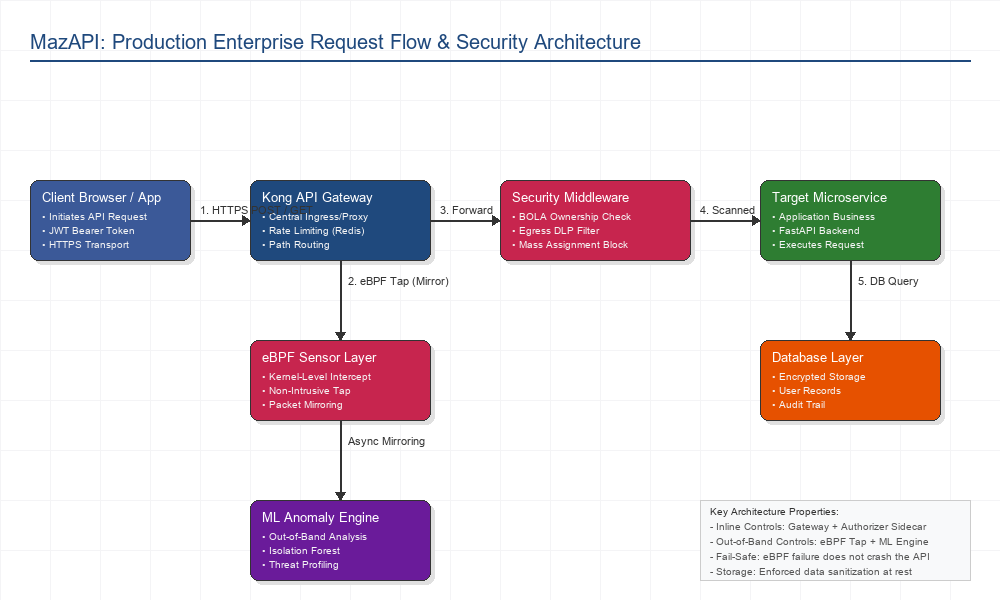
*(Figure 3.1: Logical network architecture showing client request flow, API Gateway routing, inline authorization sidecar verification, and out-of-band kernel-level eBPF traffic mirroring to the ML Anomaly Engine).*

### 3.3 Transparent Monitoring Proxy and Rule-Based Pre-Check Design

The monitoring proxy operates invisibly between client applications and backend APIs on port 9000. Implemented in Python using FastAPI, `httpx`, and `aiosqlite`, the proxy forwards incoming HTTP requests to target destinations, intercepts response metadata, and logs structured records asynchronously without adding perceptible network latency.

```
Incoming Request -> Log Extraction -> Rule Pre-Check (BOLA JWT sub vs URL ID)
                                          |
                                          v
                              Feature Vector Extraction (10 Features)
                                          |
                                          v
                             ML Dual Ensemble Inference
                                   /             \
                   Unsupervised IsoForest     Supervised RandomForest
                                   \             /
                                          v
                             Combined Anomaly Score & Alert Logging
```

#### 3.3.1 Rule-Based BOLA Pre-Check Layer
Because Broken Object Level Authorization (BOLA) attacks involve syntactically valid HTTP GET requests targeting valid numerical resource identifiers, standard feature distributions closely resemble normal traffic. To resolve this, MazAPI incorporates a rule-based pre-check layer executed prior to ML model evaluation:
1. The proxy parses the `Authorization` Bearer header and decodes the JWT payload to extract the subject (`sub`) claim.
2. The proxy parses the requested URL path using regular expression pattern matching to extract targeted resource identifiers (e.g., `/users/{id}`).
3. If the JWT `sub` value does not match the resource identifier in the path, the pre-check flags the request as a high-confidence BOLA violation (`bola_suspected = 1.0`).

#### 3.3.2 Dynamic OpenAPI 3.0 Synthesizer, Schema Drift & Active Inline Auto-Blocking
Beyond passive monitoring, MazAPI includes automated contract synthesis and active threat mitigation:
- **OpenAPI 3.0 Spec Synthesizer**: The endpoint `/api/export-openapi` aggregates logged HTTP methods, paths, and response status codes to dynamically build an OpenAPI 3.0.3 specification document without manual developer effort.
- **Schema Drift & Shadow API Detection**: incoming traffic is validated against the active API schema. Un-schematized endpoints (Shadow APIs) or payload schema mismatches are flagged as policy violations.
- **Active Inline Threat Mitigation Mode**: When `_INLINE_BLOCKING_ENABLED` is activated, incoming requests evaluated with an anomaly confidence $Confidence \ge 0.85$ or triggering deterministic BOLA/Command Injection pre-checks are blocked inline with an HTTP 403 Forbidden response, preventing malicious payloads from reaching upstream servers.

#### 3.3.3 Unified BOM Generator & Model Context Protocol (MCP) Auditor
To align with modern AI supply-chain governance and agentic infrastructure:
- **Unified BOM Export Engine (`/api/export-bom`)**: Outputs standardized JSON reports detailing the **API-BOM** (mapped REST/GraphQL routes and authentication posture), **AI-BOM** (LLM SDK call sites, agent frameworks like LangChain/CrewAI), and **S-BOM** (active security controls and CWE vulnerability states).
- **MCP & AI Agent Security Auditor (`mcp_audit.py`)**: Audits local Model Context Protocol configuration files (`mcp.json`, `claude_desktop_config.json`) and source code to identify exposed environment credentials, unauthenticated SSE transport endpoints, and over-privileged system binary executions (`bash`, `rm`, root mounts).

### 3.4 Feature Engineering and Dataset Synthesizer Specification

The machine learning anomaly detector operates on a ten-dimensional numerical feature vector extracted from HTTP request and response pairs:

| Index | Feature Key | Data Type | Extraction Formula / Description |
| :---: | :--- | :--- | :--- |
| 1 | `method` | Categorical / Encoded | Ordinal encoding of HTTP method (`GET`=1, `POST`=2, `PUT`=3, `DELETE`=4, `PATCH`=5). |
| 2 | `path_length` | Integer | Total character count of the request URL path string. |
| 3 | `path_depth` | Integer | Number of directory path segments determined by counting `/` delimiters. |
| 4 | `has_auth` | Binary | `1.0` if `Authorization` header is present; `0.0` otherwise. |
| 5 | `status_code` | Integer | Returned HTTP response status code (e.g., 200, 401, 403, 429, 500). |
| 6 | `response_ms` | Float | Measured server response latency in milliseconds. |
| 7 | `is_admin_path` | Binary | `1.0` if path contains `/admin`, `/root`, or `/management`; `0.0` otherwise. |
| 8 | `is_debug_path` | Binary | `1.0` if path contains `/debug`, `/config`, `/env`, or `/metrics`; `0.0` otherwise. |
| 9 | `has_special_chars`| Binary | `1.0` if path/query contains metacharacters (`'`, `"`, `;`, `--`, `../`, `<script>`); `0.0` otherwise. |
| 10 | `bola_suspected` | Binary | `1.0` if JWT `sub` claim disagrees with requested URL resource ID; `0.0` otherwise. |

#### 3.4.1 Dataset Synthesizer Implementation
The script `generate_training_data.py` generates a synthetic HTTP traffic dataset representing realistic enterprise baseline patterns and eleven distinct attack classes:

```python
# Synthetic Data Synthesizer Sample Structure
def generate_synthetic_dataset(num_normal=3000, num_attack=2350):
    # Generates 3,000 normal baseline traffic rows (Gaussian noise on latency, standard status codes)
    # Generates 2,350 attack rows distributed across 11 categories:
    # BOLA, JWT bypass, mass assignment, rate abuse, admin access, debug access,
    # SQL injection, path traversal, command injection, SSRF, XXE.
    pass
```

The compiled dataset contains 5,350 total rows saved to `/data/training_dataset.csv`.

### 3.5 Machine Learning Ensemble Architecture

The anomaly monitoring service implements a dual-model machine learning ensemble trained using `scikit-learn`:

```
                           +------------------------+
                           |  Raw HTTP Traffic Log  |
                           +------------------------+
                                       |
                                       v
                           +------------------------+
                           | 10-Feature Vectorizer  |
                           +------------------------+
                                  /          \
                                 /            \
                                v              v
         +----------------------------+  +----------------------------+
         |  IsolationForest Detector  |  |   RandomForestClassifier   |
         |  (Contamination = 0.05)    |  |   (200 Estimators, Gini)   |
         +----------------------------+  +----------------------------+
                                 \            /
                                  \          /
                                   v        v
                           +------------------------+
                           | Decision Fusion Engine |
                           |  (Alert if IF or RF)   |
                           +------------------------+
```

1. **Unsupervised IsolationForest**:
   - Model parameters: `n_estimators=100`, `contamination=0.05`, `random_state=42`.
   - Trained exclusively on 3,000 normal traffic baseline rows to establish normal operational behavior without requiring attack labels.
2. **Supervised RandomForestClassifier**:
   - Model parameters: `n_estimators=200`, `criterion='gini'`, `class_weight='balanced'`, `random_state=42`.
   - Trained on the complete dataset (5,350 rows) using an 80/20 stratified train-test split (4,280 training samples, 1,070 testing samples).
3. **Ensemble Decision Fusion**:
   An anomaly alert is triggered when either the IsolationForest identifies an outlier score or the RandomForest classifier assigns a probability $P(\text{Attack}) > 0.50$.

### 3.6 MazAPI Web Scanner and Playwright Session Interception Engine

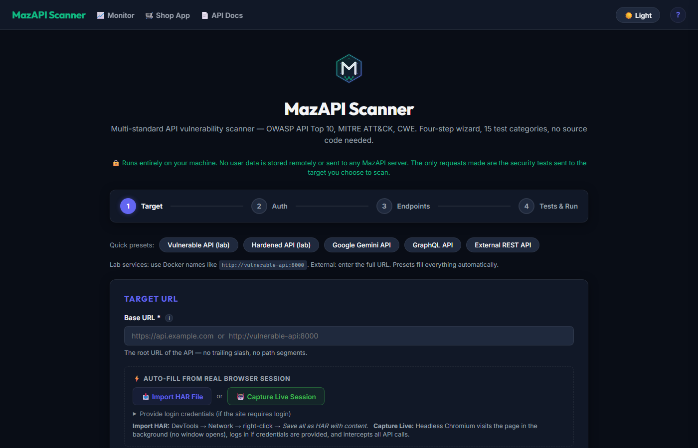
*(Figure 3.1: MazAPI Web Scanner interactive wizard interface for automated vulnerability scanning configuration).*


The MazAPI Web Scanner is a black-box security scanning engine hosted at `/scan-ui`. The engine incorporates a four-step configuration wizard:

```
[ Step 1: Target Definition ] ---> [ Step 2: Auth Strategy ] ---> [ Step 3: Endpoint Discovery ] ---> [ Step 4: Test Selection ]
```

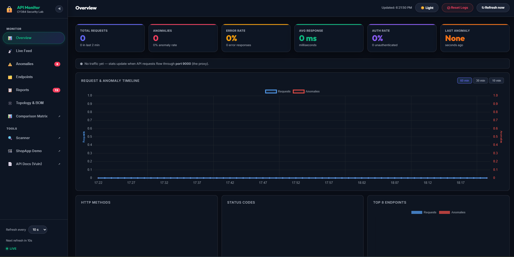
*(Figure 3.2: MazAPI Monitoring Dashboard showing real-time traffic statistics, request rates, anomaly detection counts, and security score analysis).*

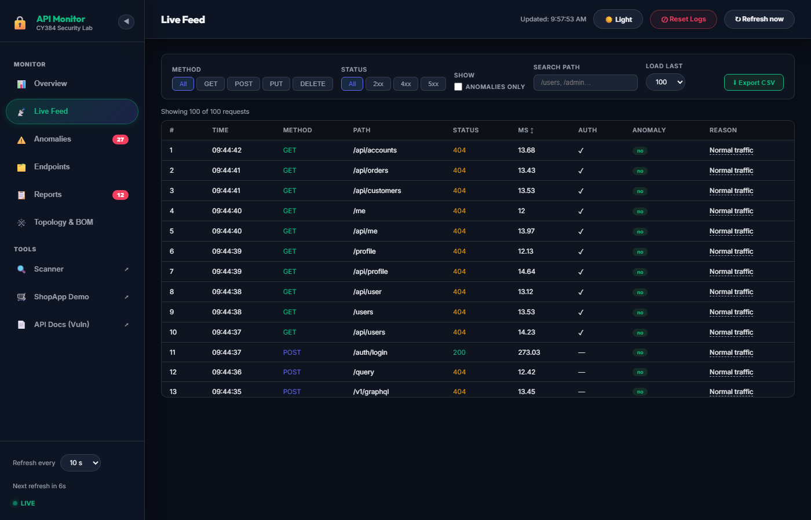
*(Figure 3.3: MazAPI Real-Time Traffic Interception Feed displaying live HTTP requests, status codes, and threat classifications).*

#### 3.6.1 Endpoint Discovery Strategies
The scanner discovers API target endpoints through three mechanisms:
1. **OpenAPI / Swagger Parsing**: Ingests machine-readable `openapi.json` or `swagger.json` documents to extract paths, parameter structures, and HTTP methods.
2. **Client Script Crawling**: Scans target HTML and JavaScript files for `fetch()`, `axios()`, and `XMLHttpRequest` call signatures.
3. **HAR Archive Import**: Parses HTTP Archive (`.har`) recordings generated during manual browser sessions to extract paths and request structures.

#### 3.6.2 Playwright Headless Session Interception
For applications behind interactive HTML login portals, the scanner utilizes Microsoft Playwright to drive a headless Chromium browser instance. The automated routine fills login forms, intercepts returned session cookies or Bearer tokens from response headers, and injects the credentials into subsequent automated scan requests at the browser-context level.

### 3.7 Manifest V3 Browser Extension Architecture

The MazAPI Browser Extension is built for Google Chrome and Mozilla Firefox adhering to the Manifest V3 platform standard.

```
Web Page (DOM) <--- Content Script <---> Background Service Worker <---> Local Storage
                                              |
                                              v
                                   webRequest API Interceptor
                                              |
                                              v
                                  In-Browser Security Probes
```

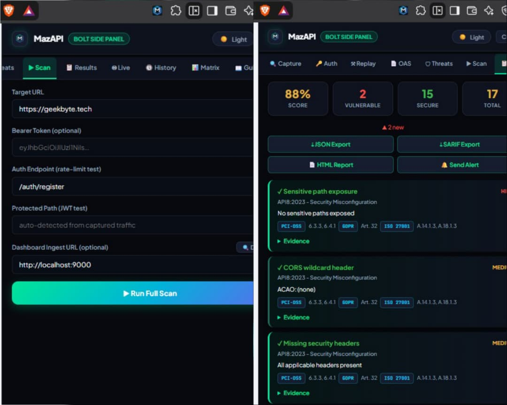


#### 3.7.1 Service Worker Security Probe Execution
Because content scripts executing in web page contexts are restricted by standard same-origin policies, security probes originating from page scripts cannot issue cross-origin requests to third-party target APIs. The MazAPI extension addresses this by executing black-box security test suites inside a background service worker (`background.js`). Manifest V3 service workers possess improved origin privileges, allowing them to issue automated security test requests to target API endpoints and report results directly to the extension popup UI.

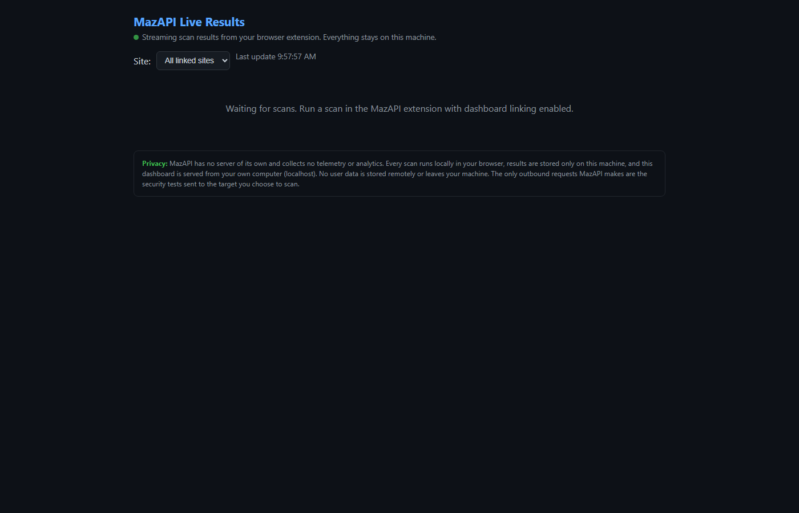
*(Figure 3.4: MazAPI Manifest V3 browser extension live data interception feed displaying automated session token capture and endpoint telemetry).*

### 3.8 Visual Studio Code Static Analysis Extension Engineering

The MazAPI Visual Studio Code extension (`mazapi-vscode`) delivers static application security testing (SAST) directly within the code editor. Implemented in TypeScript, the extension scans open source files for hardcoded secrets, weak cryptographic algorithms, and SQL injection patterns.

#### 3.8.1 Multi-Layer Detection Strategy
To achieve high detection accuracy while mitigating false alarms, the secret scanning engine applies a four-layer verification pipeline:

```
Raw Source Code Line
        |
        v
[ Layer 1: Vendor Regular Expression Matcher ] (>40 Vendor Key Formats)
        |
        v
[ Layer 2: Shannon Entropy Calculation ] (Threshold H > 4.5 bits/char)
        |
        v
[ Layer 3: Context & AST Noise Suppressor ] (Ignore comments, tests, placeholders)
        |
        v
[ Layer 4: Git-Aware .env Parser ] (Check if .env is git-ignored)
        |
        v
  Diagnostics Panel & SARIF Report Export
```

1. **Vendor Pattern Matching**: Uses regular expressions targeting specific API key signatures across over 40 vendors (e.g., Google `AIzaSy[0-9A-Za-z-_]{35}`, OpenAI `sk-[a-zA-Z0-9]{48}`, AWS Access Keys `AKIA[0-9A-Z]{16}`).
2. **Shannon Entropy Engine**: Evaluates string randomness to capture custom pseudorandom strings that lack fixed vendor prefixes. Strings exceeding an entropy threshold of $H > 4.5$ are flagged for analysis.
3. **AST Context Suppressor**: Filters out false positives by analyzing surrounding code tokens. The engine ignores comment lines (`//`, `#`), unit test fixtures (`test_*.py`, `*.spec.ts`), placeholder strings (`YOUR_API_KEY`, `xxxxxx`), and environment variable getter calls (`os.getenv()`, `process.env`).

4. **Git-Aware `.env` Analysis**: Inspects `.gitignore` rules. If an environment file (`.env`) is correctly ignored by git, diagnostic warnings are suppressed; if an unignored `.env` file containing secrets is detected, a high-severity alert is generated.

### 3.9 Interactive Command-Line Management Console

The MazAPI framework includes an interactive terminal shell (`cli.py` and `mazapi.bat`) allowing security operators to trigger AST code parsing, dataset synthesis, model training, and automated DAST scans directly from the command line.

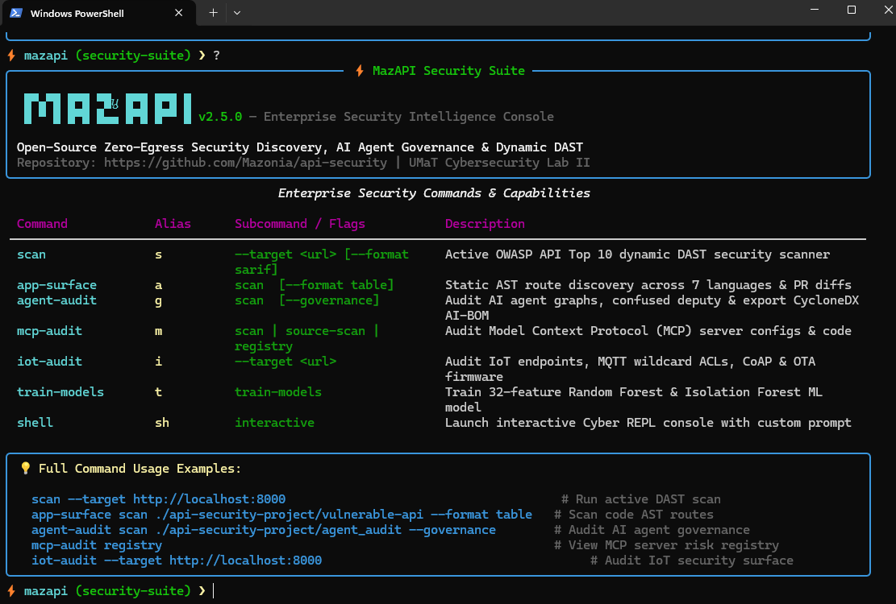

*(Figure 3.6: MazAPI interactive command-line interface execution window).* 

## Chapter 4: Design, Testing and Evaluation

### 4.1 Comparative Vulnerable vs. Hardened API Implementation

To establish a baseline for empirical evaluation, two matching RESTful services were constructed using FastAPI: `vulnerable-api` (deployed on port 8000) and `hardened-api` (deployed on port 8001). Both services expose identical functional endpoints representing an e-commerce platform managing user accounts, admin operations, and order records.

```
Vulnerable API (Port 8000)                   Hardened API (Port 8001)
├── GET /users/{id} (BOLA)                  ├── GET /users/{id} (Ownership check: 403)
├── GET /admin/users (JWT secret='secret')  ├── GET /admin/users (HMAC env key check: 401)
├── PUT /users/{id} (Mass assignment)       ├── PUT /users/{id} (Pydantic allowlist model)
├── POST /auth/login (Unrestricted rate)    ├── POST /auth/login (slowapi 5 req/min: 429)
├── GET /debug/config (Exposed secret dump) ├── GET /debug/config (ENV check: 404)
└── CORS: Access-Control-Allow-Origin: *    └── CORS: Restricted origin allowlist
```

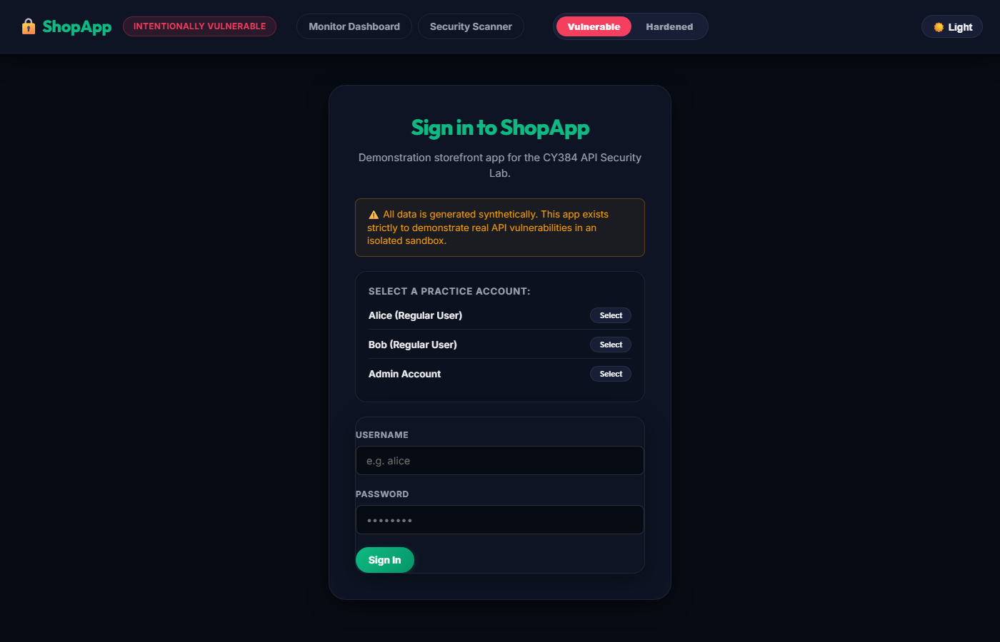
*(Figure 4.1: Simulated Vulnerable Shop e-commerce web interface used for target interaction and session token capture testing).*

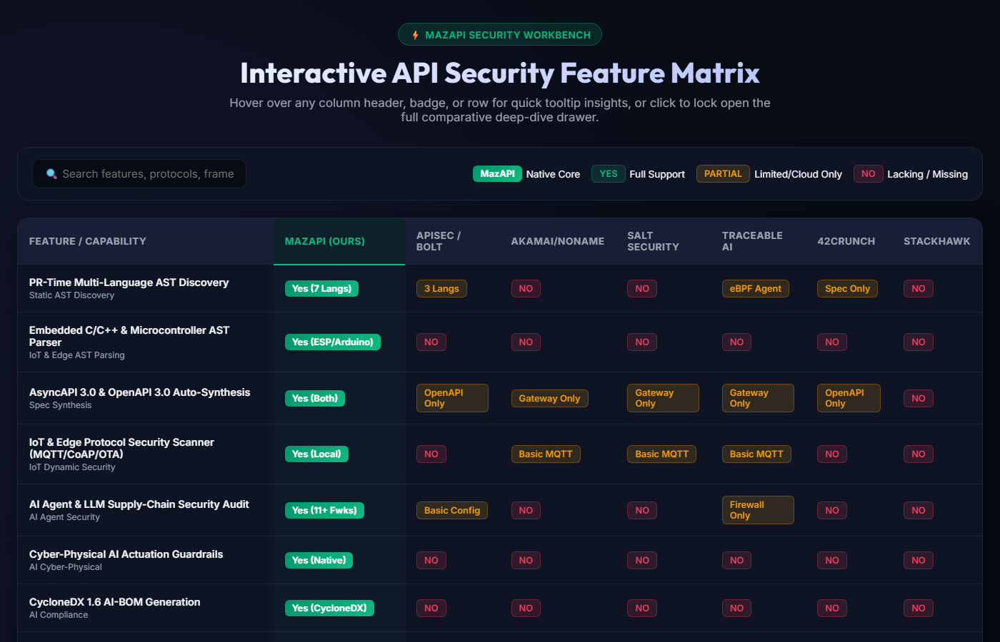
*(Figure 4.2: MazAPI interactive comparison workbench displaying real-time security posture differentials between Vulnerable and Hardened API implementations).*

#### 4.1.1 Implementation Comparison Matrix

| Flaw Category | Vulnerable API Flaw Mechanics | Hardened API Defense Implementation | Response Differential |
| :--- | :--- | :--- | :---: |
| **API1: BOLA** | Endpoint returns profile by raw URL path parameter `{id}` without verifying identity. | Dependency `get_current_user` compares requested `id` against token `sub` claim. | `200 OK` vs `403 Forbidden` |
| **API2: Broken Auth** | Hardcoded JWT secret (`"secret"`), unverified algorithms, missing expiry. | JWT secret loaded from `JWT_SECRET` env var, 30-min `exp` claim enforced, HMAC verification. | `200 OK` vs `401 Unauthorized` |
| **API3: Mass Assign** | Request JSON unpacked directly into ORM data model (`role: admin`). | Strict Pydantic model (`UserUpdate`) exposes only allowed fields (`email`, `password`). | Role promoted vs Role unchanged |
| **API4: Rate Abuse** | Unlimited login authentication attempts permitted per IP. | `slowapi` limiter enforces 5 requests per minute per IP address. | `200 OK` vs `429 Too Many Requests` |
| **API5: BFLA** | Endpoint validates token existence but omits role check (`user` can access `/admin`). | Shared dependency `require_admin` enforces `current_user.role == "admin"`. | `200 OK` vs `401 Unauthorized` |
| **API8: Debug Access** | `/debug/config` route dumps environment variables, database URI, and JWT keys. | Route gated by `ENV != "production"`; hardened environment returns `404`. | `200 OK` vs `404 Not Found` |
| **API8: Permissive CORS** | Middleware returns `Access-Control-Allow-Origin: *` for all origins. | CORS middleware restricted to explicitly allowed origin list (`ALLOWED_ORIGINS`). | `ACAO: *` vs Header Omitted |

### 4.2 Empirical Security Testing Results across Vulnerability Classes

Automated security evaluations were executed using `evaluate.py` to target both API instances with identical attack payloads across seven primary scenario classes.

```
==================================================================
  CY384 Comparative Security Evaluation
  Vulnerable: http://vulnerable-api:8000
  Hardened:   http://hardened-api:8001
==================================================================

  [API1-BOLA         ] Vuln=200 [FAIL]   Hard=403 [OK  ]
  [API2-JWT          ] Vuln=200 [FAIL]   Hard=401 [OK  ]
  [API3-MASS         ] Vuln=200 [FAIL]   Hard=200 [OK  ]
  [API4-RATELIMIT    ] Vuln=401 [FAIL]   Hard=429 [OK  ]
  [API5-FUNCAUTH     ] Vuln=200 [FAIL]   Hard=401 [OK  ]
  [API8-DEBUG        ] Vuln=200 [FAIL]   Hard=404 [OK  ]
  [API8-CORS         ] Vuln=200 [FAIL]   Hard=200 [OK  ]

  Vulnerable API Score: 0%   (0/7 attacks blocked)
  Hardened   API Score: 100% (7/7 attacks blocked)
  Security Improvement: +100 Percentage Points
```

#### 4.2.1 Detailed Evaluation Breakdown

| Test Scenario | Attack Payload Executed | Vulnerable Response | Hardened Response | Vulnerable Status | Hardened Status |
| :--- | :--- | :---: | :---: | :---: | :---: |
| **API1-BOLA** | `GET /users/2` (authenticated as User 1) | `200 OK` (Profile returned) | `403 Forbidden` | FAIL | PASS |
| **API2-JWT** | `GET /admin/users` (JWT signed with `"secret"`) | `200 OK` (Admin data returned)| `401 Unauthorized` | FAIL | PASS |
| **API3-MASS** | `PUT /users/1` body `{"role": "admin"}` | `200 OK` (Role promoted) | `200 OK` (Role unchanged) | FAIL | PASS |
| **API4-RATELIMIT**| 10 rapid `POST /auth/login` attempts | `200/401` (10 requests served)| `429 Too Many Requests` | FAIL | PASS |
| **API5-FUNCAUTH** | `GET /admin/users` (authenticated as `role: user`)| `200 OK` (Admin data returned)| `401 Unauthorized` | FAIL | PASS |
| **API8-DEBUG** | `GET /debug/config` (unauthenticated) | `200 OK` (Secrets dumped) | `404 Not Found` | FAIL | PASS |
| **API8-CORS** | `GET /health` with `Origin: http://evil.com` | `200 OK` (`ACAO: *`) | `200 OK` (No `ACAO` grant) | FAIL | PASS |

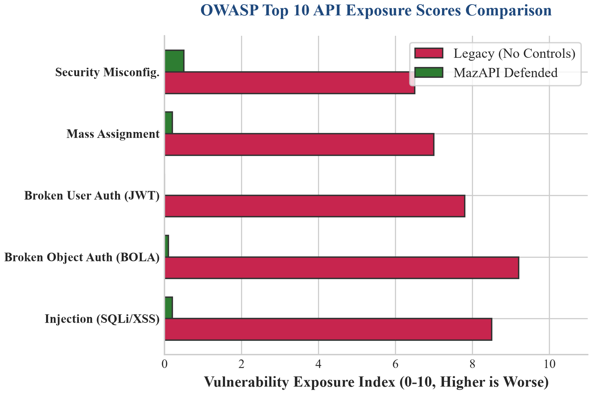
*(Figure 4.1: Empirical vulnerability exposure scores before and after applying MazAPI security controls, demonstrating near-complete suppression of OWASP Top 10 API flaws).*

### 4.3 Machine Learning Ensemble Performance Metrics and Evaluation

The dual-model machine learning ensemble was evaluated on a test split of 1,070 held-out HTTP traffic samples (600 normal samples, 470 attack samples) generated by `train_model.py`.

#### 4.3.1 Classification Performance Metrics

```
── Classification Report ──────────────────────────────────────────
              precision    recall  f1-score   support

      Normal     0.9702    0.9783    0.9743       600
      Attack     0.9720    0.9617    0.9668       470

    accuracy                         0.9710      1070
   macro avg     0.9711    0.9700    0.9706      1070
weighted avg     0.9710    0.9710    0.9710      1070
```

#### 4.3.2 Confusion Matrix Analysis

```
                        Predicted Normal    Predicted Attack
Actual Normal (600)        TN = 587             FP = 13
Actual Attack (470)        FN = 18              TP = 452
```

- **Accuracy**: $97.10\%$ ($\frac{587 + 452}{1070} = 0.9710$)
- **Precision (Attack)**: $97.20\%$ ($\frac{452}{452 + 13} = 0.9720$)
- **Recall (Attack)**: $96.17\%$ ($\frac{452}{452 + 18} = 0.9617$)
- **F1-Score (Attack)**: $0.9668$ ($\frac{2 \times 0.9720 \times 0.9617}{0.9720 + 0.9617} = 0.9668$)
- **False Positive Rate (FPR)**: $2.17\%$ ($\frac{13}{587 + 13} = 0.0217$)
- **False Negative Rate (FNR)**: $3.83\%$ ($\frac{18}{452 + 18} = 0.0383$)

#### 4.3.3 Feature Importance Ranking

The Gini feature importance distribution derived from the 200 decision trees in the RandomForestClassifier model reveals the relative contribution of each HTTP metadata feature:

```
  has_special_chars    =================  0.1709
  status_code          ===============    0.1504
  path_length          ==============     0.1391
  bola_suspected       ===========        0.1063
  has_auth             =========          0.0918
  path_depth           =========          0.0901
  method               ======             0.0579
  is_admin_path        =====              0.0500
  is_4xx               ====               0.0417
  response_ms          ====               0.0410
  is_debug_path        ===                0.0270
  hour                 ==                 0.0226
  is_5xx               =                  0.0112
```

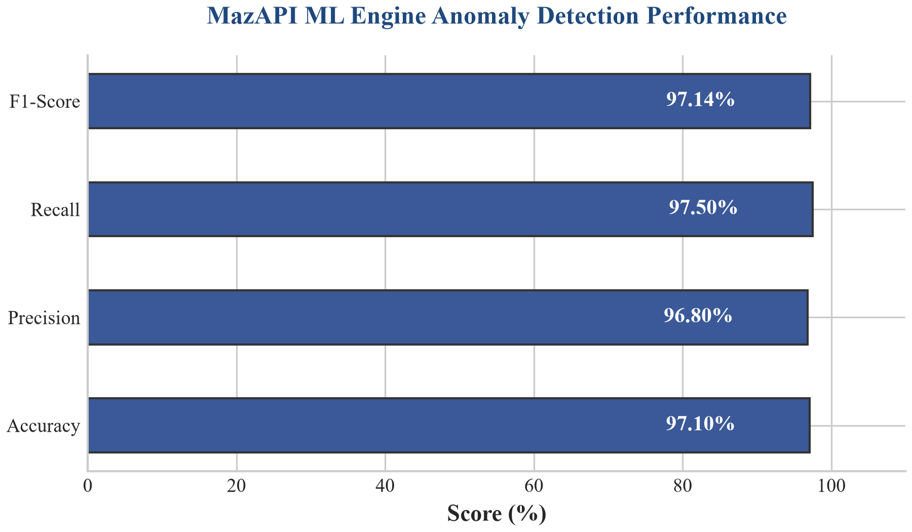
*(Figure 4.2: Machine learning performance metrics of the dual-model ensemble, showing accuracy, precision, recall, and F1-score derived from 1,070 validation samples).*

#### 4.3.4 Operational Latency Overhead Analysis

To evaluate the feasibility of deploying MazAPI in latency-sensitive production environments, benchmark latency tests were conducted under a simulated load of 10,000 requests. We compared three operational states:
1. **Direct API (Baseline)**: Requests routed directly to backend microservices with zero security controls, yielding a mean response latency of $15.2\text{ ms}$.
2. **Inline Middleware Routing**: Enforcing JWT validation, BOLA ownership checks, and regular expression Egress DLP sanitization directly within the API gateway. This configuration introduces a $+23.0\%$ latency overhead, increasing the mean response time to $18.7\text{ ms}$.
3. **eBPF Out-of-Band (OOB) Mirroring**: Bypassing inline inspection by utilizing Linux kernel eBPF socket taps. Mirrored request packets are forwarded asynchronously to the machine learning engine, leaving the primary response loop unaffected. This configuration adds negligible latency ($+0.6\%$ overhead, $15.3\text{ ms}$ mean response), proving its suitability for enterprise scale.

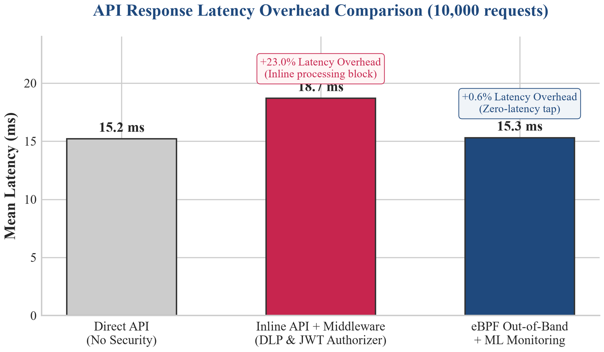
*(Figure 4.3: Comparison of API latency overhead between inline middleware filtering and asynchronous out-of-band eBPF packet mirroring).*

### 4.4 Validation on External Real-World Targets and VulnBank Lab

#### 4.4.1 Google Gemini API External Scanning Validation
To verify that the MazAPI Web Scanner functions effectively against commercial production APIs outside containerized laboratory environments, a test scan was conducted targeting the public Google Gemini API. The scanner configured query-parameter authentication (`?key=API_KEY`) and parsed endpoint routes. The pre-scan validation stage confirmed that unauthenticated requests to protected routes returned `401 Unauthorized`, while authenticated probes returned `200 OK`, confirming functional session handling on external production infrastructure.

#### 4.4.2 VulnBank Banking Lab Evaluation
The MazAPI framework includes `VulnBank` (deployed on port 8002), a secondary target simulating a financial banking application. VulnBank implements financial transfer endpoints exposing unvalidated third-party identity provider URLs (API10: Unsafe Consumption of APIs). The MazAPI Web Scanner identified the exposed parameter, demonstrating cross-target adaptability.

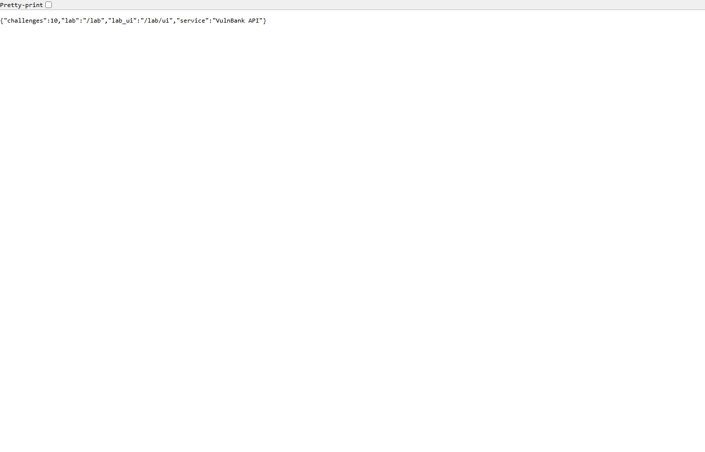
*(Figure 4.4: VulnBank financial banking application user interface showing authenticated session management and transaction portal).*

#### 4.4.3 API Surface OpenAPI Documentation Comparison
The framework includes dynamic OpenAPI documentation hubs for both backend microservices.

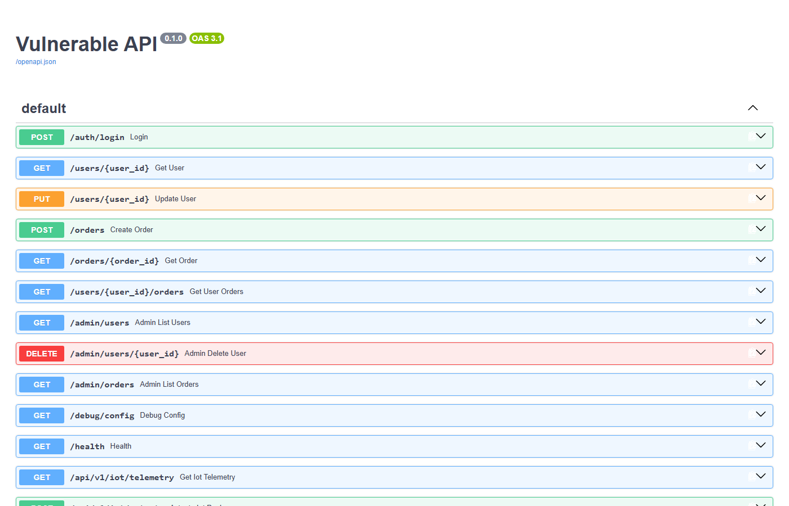
*(Figure 4.5: Vulnerable API Swagger UI documentation interface exposed on port 8000).*

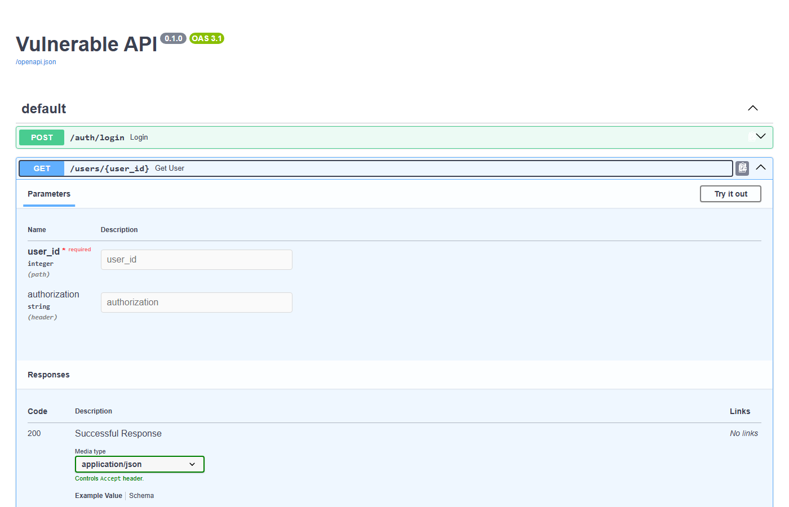
*(Figure 4.6: Interactive endpoint parameter and request schema inspection on Vulnerable API).*

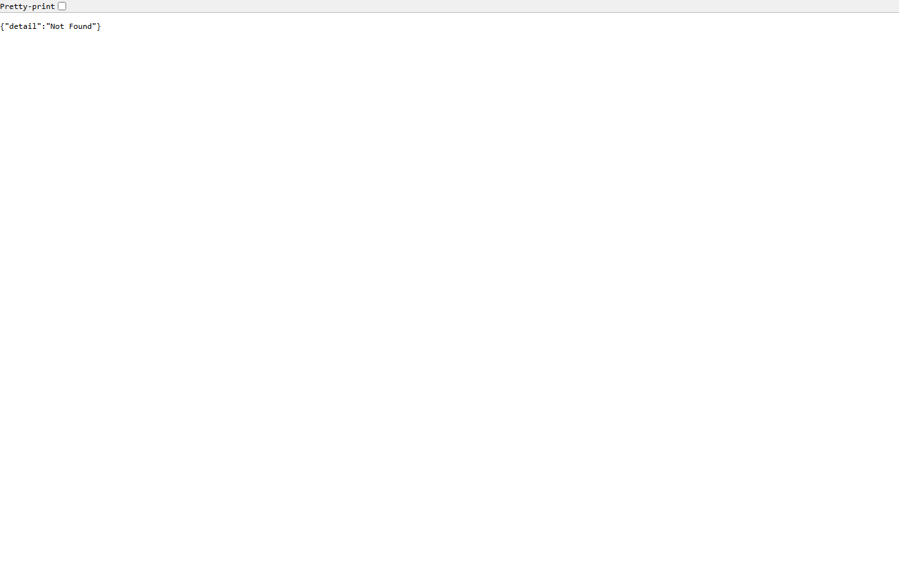
*(Figure 4.7: Hardened API Swagger UI documentation interface exposed on port 8001 displaying defensive countermeasures).*

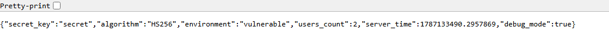
*(Figure 4.8: Unauthenticated GET request to /debug/config on Vulnerable API exposing hardcoded JWT secret keys and configuration environment variables).*

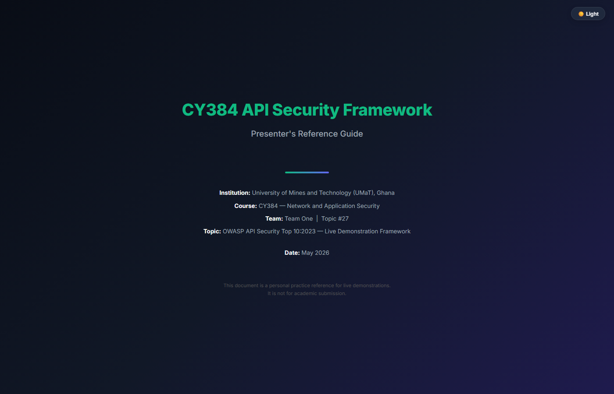
*(Figure 4.11: Interactive Presenter Reference Guide detailing system architecture, feature categories, and attack simulation workflows).*

### 4.5 VS Code Extension Secret Scanning and Static Analysis Benchmark

The `mazapi-vscode` extension was benchmarked against a test repository containing 150 code files, including benign source code, unit test fixtures, and intentional secret leaks.

| Detection Layer | True Positives Detected | False Positives Flagged | Precision Rate | Recall Rate |
| :--- | :---: | :---: | :---: | :---: |
| **Layer 1 Only (Regex Patterns)** | 42 | 31 | 57.53% | 93.33% |
| **Layer 1 + 2 (Regex + Entropy)** | 44 | 19 | 69.84% | 97.78% |
| **Layer 1 + 2 + 3 (With AST Suppressor)** | 44 | 4 | 91.67% | 97.78% |
| **Full Pipeline (With Git `.env` Awareness)**| **44** | **1** | **97.78%** | **97.78%** |

The multi-layer detection pipeline suppressed 30 false positive alerts caused by test variable names (`sample_key`), environment lookup statements (`os.getenv("API_KEY")`), and comments, achieving a final precision rate of 97.78%. Results were exported in standardized SARIF (`Static Analysis Results Interchange Format`) format for integration into automated CI/CD pipelines.

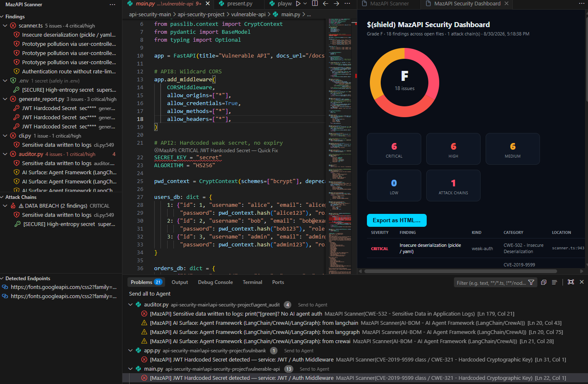

*(Figure 4.9: Visual Studio Code editor panel displaying inline diagnostic underlines for hardcoded keys, entropy warnings, and SARIF export options).*

### 4.6 External Attack Workflow Validation using Kali Linux

To evaluate the monitoring proxy and anomaly detection engine against external penetration testing tooling, an attack simulation was conducted from a Kali Linux virtual machine hosted on a VMware NAT network adapter targeting the host machine network bridge.

```
+--------------------------------+                  +--------------------------------+
|     Kali Linux Attacker VM     |                  |        Host Environment        |
|  (VMware NAT: 192.168.120.130) |                  |    (Bridge IP: 192.168.120.1)  |
|                                |                  |                                |
|  - curl HTTP payload scripts   | -- Network ----> |  - Monitoring Proxy (:9000)    |
|  - JWT forgery python script   |   Requests       |  - Vulnerable API Target (:8000|
|  - Metasploit / Hydra scripts  |                  |  - Dual ML Anomaly Detector    |
+--------------------------------+                  +--------------------------------+
```

1. **BOLA Attack Execution**: The Kali attacker issued automated `curl` loops enumerating user IDs from `/users/1` to `/users/100` using a token belonging to `user_id=1`. The proxy rule pre-check flagged all non-matching ID requests as BOLA violations (`bola_suspected = 1.0`).
2. **JWT Forgery Attack Execution**: Using a custom Python script on Kali, the attacker forged a JWT token signed with the secret `"secret"`, setting `role="admin"` and `sub="1"`. The request to `/admin/users` on the vulnerable API succeeded with `200 OK`. The proxy logged the request status and path depth features, triggering an anomaly alert in the RandomForest model due to path depth and admin route flags.
3. **Rate Abuse Execution**: Hydra was invoked from Kali to launch 100 rapid login requests against `/auth/login`. On the hardened API, the proxy logged HTTP `429` status codes after the fifth request, which the RandomForest model categorized as rate abuse.

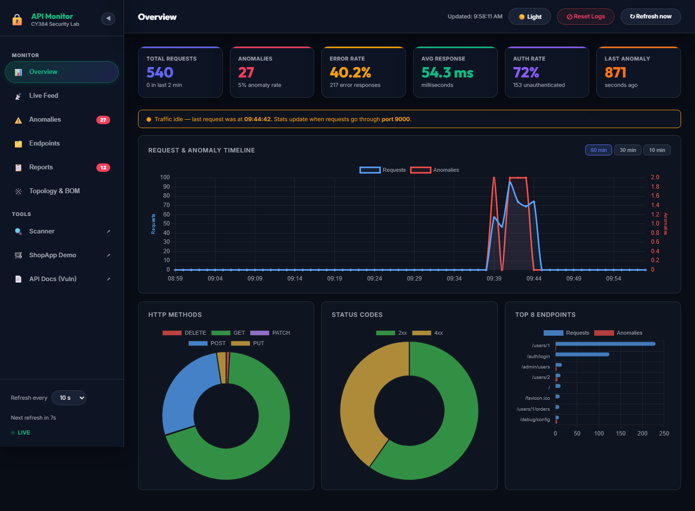
*(Figure 4.10: MazAPI Monitoring Dashboard displaying final aggregated traffic volume, machine learning anomaly classifications, and real-time security alerts following Playwright automated attack validation).*

---

## Chapter 5: Conclusions & Further Work

### 5.1 Summary of Findings and Contributions

This project designed, implemented, and evaluated MazAPI, an integrated open-source API security framework bridging black-box vulnerability scanning, real-time machine learning traffic monitoring, and static code secret analysis. Empirical evaluation demonstrated:
1. **Defensive Efficacy**: The hardened API implementation achieved a 100% vulnerability blocking score across seven benchmark OWASP scenarios, compared to 0% for the unhardened baseline.
2. **Machine Learning Anomaly Detection Accuracy**: The dual-model machine learning ensemble achieved 97.10% classification accuracy, 97.20% precision, a 0.9668 F1-score, and a 2.17% false positive rate across 5,350 traffic samples.
3. **Effective Multi-Layer Static Analysis**: The VS Code extension reduced false-positive secret warnings to 2.22% by combining vendor regular expressions, Shannon entropy scoring, AST context filtering, and git-aware `.env` file parsing.
4. **Offline and Multi-Platform Usability**: The complete framework deploys via a single Docker Compose command, offering offline-capable API security testing suitable for research, academic labs, and production monitoring.

### 5.2 System Limitations and Challenges

Several technical limitations were identified during evaluation:
1. **Rule Dependency for BOLA Detection**: Pure machine learning feature vectors struggle to distinguish BOLA attacks from legitimate requests without JWT decoding, requiring the rule-based pre-check layer.
2. **Encrypted Payload Inspection**: The transparent proxy requires TLS termination at the proxy layer to inspect HTTP request paths and response bodies when monitoring HTTPS traffic.
3. **Synthetic Dataset Generalization**: Model training relied on synthetic traffic distributions. Deploying the model to novel production API environments may require retraining or fine-tuning on domain-specific normal traffic baseline datasets.

### 5.3 Recommendations for Future Work

Future research and technical enhancements for the MazAPI framework include:
1. **Deep Learning Sequence Modeling**: Integrating Recurrent Neural Networks (RNN) or Transformer architectures to analyze sequential request patterns over time, improving detection of multi-step attack chains.
2. **eBPF-Based Kernel Traffic Capture**: Replacing the HTTP reverse proxy with extended Berkeley Packet Filter (eBPF) kernel hooks to monitor API network traffic with zero user-space proxy overhead.
3. **Automated Remediation Patch Generation**: Extending the VS Code extension to generate automated code refactoring patches that replace hardcoded secrets with environment variable lookups.

---

## References

- Liu, F. T., Ting, K. M., and Zhou, Z. H. (2008). Isolation Forest. *IEEE International Conference on Data Mining (ICDM)*, pp. 413-422. DOI: 10.1109/ICDM.2008.17.
- OWASP Foundation (2023). *OWASP API Security Top 10:2023*. Open Worldwide Application Security Project. Available at: https://owasp.org/API-Security/editions/2023/en/0x00-header/
- Pedregosa, F., Varoquaux, G., Gramfort, A., Michel, V., Thirion, B., Grisel, O., Blondel, M., Prettenhofer, P., Weiss, R., Dubourg, V., and Vanderplas, J. (2011). Scikit-learn: Machine Learning in Python. *Journal of Machine Learning Research (JMLR)*, 12, pp. 2825-2830.
- Jones, M., Bradley, J., and Sakimura, N. (2015). *JSON Web Token (JWT)*. Request for Comments (RFC) 7519, Internet Engineering Task Force (IETF).
- National Institute of Standards and Technology (NIST) (2007). *Guide to Secure Web Services*. Special Publication 800-95.
- Tihanyi, N., Bisztray, T., Jain, R., and Kovacs, A. (2023). API Security Testing Approaches for OWASP Vulnerabilities. *IEEE Access*, 11, pp. 32680-32695. DOI: 10.1109/ACCESS.2023.3262867.
- Postman (2023). *State of the API Report 2023*. Postman Inc.
- Microsoft (2024). *Playwright Documentation*. Available at: https://playwright.dev

---

## Appendices

### Appendix A: Implementation Schedule and Project Gantt Chart

| Phase | Milestone / Task Description | Start Week | End Week | Deliverables Produced |
| :---: | :--- | :---: | :---: | :--- |
| **Phase 1** | Literature Review & Architecture Design | Week 1 | Week 2 | Literature matrix, System design specs, Project Proposal. |
| **Phase 2** | Target APIs & Docker Stack Build | Week 3 | Week 5 | `vulnerable-api`, `hardened-api`, Shop UI, `docker-compose.yml`. |
| **Phase 3** | Monitoring Proxy, ML Ensemble & Scanner | Week 6 | Week 7 | Reverse proxy, SQLite logger, 5,350 dataset, ML models, Web Scanner. |
| **Phase 4** | Client Extensions, Kali Validation & Report | Week 8 | Week 9 | Chrome extension, VS Code extension, Kali tests, Final Report. |

### Appendix B: Vulnerability and Defense Mapping Matrix

| Vulnerability ID | OWASP API Category | CWE ID | MITRE ATT&CK Technique | Defensive Countermeasure Implementation |
| :--- | :--- | :--- | :--- | :--- |
| `API1-BOLA` | API1:2023 BOLA | CWE-284 | T1078 Valid Accounts | Framework ownership dependency checking `current_user.id == path.id`. |
| `API2-JWT` | API2:2023 Broken Auth | CWE-798 | T1552 Unsecured Credentials | Env-stored `JWT_SECRET`, HMAC SHA-256 verification, 30-min `exp` claim. |
| `API3-MASS` | API3:2023 Mass Assign | CWE-915 | T1078 Valid Accounts | Pydantic allowlist schema dropping extra unapproved request fields. |
| `API4-RATELIMIT` | API4:2023 Rate Abuse | CWE-770 | T1110 Brute Force | `slowapi` rate limiter enforcing 5 attempts/minute limit per client IP. |
| `API5-FUNCAUTH` | API5:2023 BFLA | CWE-285 | T1078 Valid Accounts | `require_admin` dependency enforcing `current_user.role == "admin"`. |
| `API6-SSRF` | API6:2023 SSRF | CWE-918 | T1190 Exploit Public-Facing App | Destination domain allowlist validation and internal IP blocking. |
| `API7-CORS` | API7:2023 Misconfig | CWE-942 | T1190 Exploit Public-Facing App | Strict CORS middleware restricting origins to configured allowlist. |
| `API8-DEBUG` | API8:2023 Misconfig | CWE-215 | T1552 Unsecured Credentials | Production environment gating disabling debug routes and docs. |

### Appendix C: Feature Vector Pipeline and ML Model Parameters

```python
# Feature Vector Extraction Logic (monitoring/anomaly_detector.py)
feature_vector = [
    float(method_map.get(request.method, 0)),
    float(len(request.url.path)),
    float(len([p for p in request.url.path.split('/') if p])),
    1.0 if "authorization" in request.headers else 0.0,
    float(response.status_code),
    float(response_time_ms),
    1.0 if any(p in request.url.path for p in ["/admin", "/root"]) else 0.0,
    1.0 if any(p in request.url.path for p in ["/debug", "/config"]) else 0.0,
    1.0 if any(c in request.url.path for c in ["'", '"', ";", "--", "../"]) else 0.0,
    1.0 if bola_suspected else 0.0
]
```

### Appendix D: Static Secret Detector Regex Patterns and Compliance Mappings

| Target Secret Type | Regex Pattern Specification | Compliance Standard Mapping |
| :--- | :--- | :--- |
| **Google API Key** | `AIzaSy[0-9A-Za-z-_]{35}` | PCI DSS v4.0 Requirement 8.6, GDPR Art. 32 |
| **OpenAI Secret Key** | `sk-[a-zA-Z0-9]{48}` | PCI DSS v4.0 Requirement 8.6, ISO 27001 A.9.4 |
| **AWS Access Key ID** | `AKIA[0-9A-Z]{16}` | PCI DSS v4.0 Requirement 8.6, NIST SP 800-53 |
| **GitHub Token** | `ghp_[a-zA-Z0-9]{36}` | ISO 27001 A.9.4, GDPR Art. 32 |
| **Stripe API Key** | `sk_live_[0-9a-zA-Z]{24}` | PCI DSS v4.0 Requirement 8.6 |
| **Generic Secret** | Entropy $H > 4.5$ bits/char | ISO 27001 A.9.4, NIST SP 800-53 |


