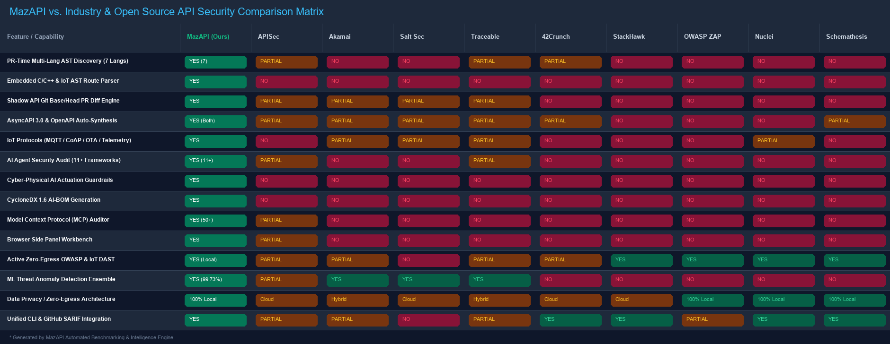

# MazAPI — Enterprise API & AI Security Intelligence Platform

[](.github/workflows/)
[](https://python.org)
[-cyan?style=flat-square)](https://owasp.org/API-Security/)
[](https://cyclonedx.org)
[](LICENSE)

Welcome to the **MazAPI Security Platform**. MazAPI is a comprehensive, zero-egress, multi-tier API and AI security ecosystem designed for modern development teams. It unifies pre-production static code discovery (AST App Surface), AI Agent & MCP supply-chain audits, active OWASP DAST vulnerability testing, calibrated machine learning threat detection, and an in-browser Side Panel interactive workbench.

Every component features a cohesive design system with **Emerald Cyber Green** and **Vivid Indigo** themes, built for high developer productivity and seamless CI/CD integration.

---

## 📂 Repository Architecture

```
api-security/
├── api-security-project/      # Core security engines, ML pipeline, and training lab
│   ├── agent_audit/           # AI Agent security auditor, rules, & CycloneDX 1.6 AI-BOM
│   ├── app_surface/           # Multi-language AST route parsers, PR diff, & SARIF exporter
│   ├── monitoring/            # Real-time proxy, 32-feature ML model, & threat dashboard
│   ├── testing-engine/        # Active OWASP API scanner, DAST engine, & MCP auditor
│   ├── vulnerable-api/        # Port 8000 — Intentionally vulnerable FastAPI service & shop
│   ├── hardened-api/          # Port 8001 — Mitigated FastAPI service with OWASP controls
│   └── cli.py                 # Unified CLI for CI/CD and terminal execution
├── mazapi-extension/          # Chrome / Brave Manifest V3 Side Panel extension
├── mazapi-vscode/             # VS Code / Antigravity IDE Workspace scanner extension
└── .github/workflows/         # Automated GitHub Actions for App Surface, Agents, and MCP
```

---

## 🌟 Key Platform Capabilities

### 1. App Surface Discovery Engine (PR-Time Static Analysis)
Detect application, API, and IoT edge attack surfaces directly from source code during Pull Request review:
*   **Multi-Language AST Parsers**: Native syntax tree extraction for 7 enterprise & embedded ecosystems:
    *   **Python**: FastAPI, Flask, Django REST Framework, Paho MQTT, aiocoap
    *   **Node.js**: Express, NestJS, Fastify, MQTT.js, CoAP.js
    *   **C/C++ Embedded IoT**: ESP-IDF `esp_http_server`, Arduino `WebServer`, FreeRTOS MQTT handlers, and micro-REST endpoints
    *   **Java**: Spring Boot (`@RestController`, `@RequestMapping`), JAX-RS
    *   **.NET**: ASP.NET Core Controllers & C# Minimal APIs
    *   **Go**: Gin, Echo, Fiber, Chi
    *   **PHP**: Laravel routing & Symfony Controller attributes
*   **Shadow API & Undocumented Route Diffing**: Compares Git commits (`--base` vs `--head`) to pinpoint newly introduced, altered, or deprecated routes before deployment.
*   **OpenAPI 3.0 & AsyncAPI 3.0 Synthesis**: Automatically synthesizes OpenAPI 3.0 and event-driven AsyncAPI 3.0 specifications straight from code and exports findings to GitHub Code Scanning (SARIF).

### 2. AI Agent Audit Engine (AI Supply-Chain & Cyber-Physical Guardrails)
Audit LLM applications, autonomous agentic workflows, and cyber-physical actuation tools before shipping to production:
*   **11+ AI Frameworks Analyzed**: LangChain, LangGraph, CrewAI, AutoGen, Semantic Kernel, LlamaIndex, Haystack, DSPy, OpenAI Swarm, AWS Bedrock Agents, and Custom Tool decorators.
*   **Deterministic Security Engines**:
    *   **Cyber-Physical IoT Actuation Guardrails**: Flags AI agent tools triggering physical actuators (locks, relays, motors, valves, HVAC) executing without Human-in-the-Loop (HITL) authorization or safety parameters.
    *   **Authorization Gaps & Confused Deputy**: Detects unauthenticated tool execution sinks where unvalidated inputs invoke privileged backend tools.
    *   **Excessive Agency**: Flags unconstrained operating system shells, dynamic SQL, file writes, and financial mutation operations (e.g., Stripe charges) executing without HITL approval.
    *   **Provider Key Exposure**: Masked detection of 15+ LLM provider API credentials (OpenAI, Anthropic, Cohere, Groq, Replicate, Hugging Face).
    *   **RAG Multi-Tenant Isolation**: Flags vector database queries (Pinecone, Chroma, Qdrant, Weaviate, Pgvector) missing tenant isolation filter constraints.
*   **CycloneDX 1.6 AI-BOM**: Generates structured AI Software Bill of Materials tracking models, parameters, data flows, and tool sinks.

### 3. Model Context Protocol (MCP) & IoT API Security Auditor
Evaluate Model Context Protocol servers and IoT protocol endpoints for vulnerabilities:
*   **IoT API Protocol Auditor**: Audits MQTT broker ACLs, CoAP UDP reflection vulnerabilities, cleartext telemetry disclosure, and insecure OTA firmware updates.
*   **Security Registry**: Evaluates server configurations against a database of 50+ vetted community and enterprise MCP servers.
*   **Static Source Scans**: Analyzes custom Python and Node.js MCP server implementations for shell injection and path traversal sinks.

### 4. Calibrated Machine Learning Anomaly Detector
*   **32-Feature Extraction Pipeline**: Measures payload size, path entropy, parameter types, authentication headers, and request timing.
*   **High-Accuracy Random Forest Model**: Calibrated classifier delivering **99.73% validation accuracy** in differentiating normal traffic from OWASP API Top 10 attacks and credential enumeration.

### 5. BOLT Browser Side Panel Workbench
A persistent Chrome/Brave Side Panel workbench (Manifest V3) running 100% locally on-device:
*   **Passive Traffic Discovery**: Automatically catalogues API routes and formats parameter templates (e.g., `/api/users/42` → `/api/users/{id}`).
*   **Auth Token Harvester & JWT Inspector**: Extracts Bearer tokens, cookies, and keys. Decodes JWT headers and payloads with instant alerts for `alg:none` bypasses and symmetric secret risks.
*   **Request Manipulator & Replay (BOLA / IDOR)**: Live request tampering workbench with a *Smart Parameter Picker* for rapid authorization testing.
*   **Selective OAS 3.0 Export**: Filter captured traffic and download formatted OpenAPI YAML or JSON specs.
*   **Correlated Threat Chains**: Graph-based multi-signal engine that links related vulnerabilities into complete attack scenarios.
*   **Active OWASP Scanner**: Runs 12+ client-side tests without sending telemetry or traffic to external cloud servers.

---

## 📊 Comprehensive Industry & Open Source Feature Comparison Matrix



| Capability / Feature | **MazAPI Platform** (Ours) | **APISec / BOLT** | **Akamai / Noname** | **Salt Security** | **Traceable AI** | **42Crunch** | **StackHawk** | **OWASP ZAP** | **Nuclei** | **Schemathesis** |
| :--- | :---: | :---: | :---: | :---: | :---: | :---: | :---: | :---: | :---: | :---: |
| **PR-Time AST Route Discovery (7 Langs)** | **Yes (7 Langs)** | ⚠️ (3 Langs) | ❌ | ❌ | ⚠️ (eBPF) | ⚠️ (Spec only) | ❌ | ❌ | ❌ | ❌ |
| **Embedded C/C++ & IoT AST Parser** | **Yes (ESP/Arduino)** | ❌ | ❌ | ❌ | ❌ | ❌ | ❌ | ❌ | ❌ | ❌ |
| **Shadow API Git Base/Head PR Diff** | **Yes (Git diff)** | ⚠️ (Planned) | ⚠️ (Runtime) | ⚠️ (Runtime) | ⚠️ (Runtime) | ❌ | ❌ | ❌ | ❌ | ❌ |
| **AsyncAPI 3.0 & OpenAPI Auto-Synthesis** | **Yes (Both)** | ⚠️ (OpenAPI) | ⚠️ (Gateway) | ⚠️ (Gateway) | ⚠️ (Gateway) | ⚠️ (OpenAPI) | ❌ | ❌ | ❌ | ⚠️ (OpenAPI) |
| **IoT Protocols (MQTT / CoAP / OTA)** | **Yes** | ❌ | ⚠️ (Basic MQTT) | ⚠️ (Basic MQTT) | ⚠️ (Basic MQTT) | ❌ | ❌ | ❌ | ⚠️ (Templates) | ❌ |
| **AI Agent Security Audit (11+ Fwks)** | **Yes (11+ Fwks)** | ⚠️ (Basic) | ❌ | ❌ | ⚠️ (Firewall) | ❌ | ❌ | ❌ | ❌ | ❌ |
| **Cyber-Physical AI Actuation Guard** | **Yes** | ❌ | ❌ | ❌ | ❌ | ❌ | ❌ | ❌ | ❌ | ❌ |
| **CycloneDX 1.6 AI-BOM Generation** | **Yes** | ❌ | ❌ | ❌ | ❌ | ❌ | ❌ | ❌ | ❌ | ❌ |
| **MCP (Model Context Protocol) Audit** | **Yes (50+ Reg)** | ⚠️ (Config) | ❌ | ❌ | ❌ | ❌ | ❌ | ❌ | ❌ | ❌ |
| **Browser Side Panel Workbench** | **Yes (Side Panel)** | ⚠️ (Popup) | ❌ | ❌ | ❌ | ❌ | ❌ | ❌ | ❌ | ❌ |
| **Active Zero-Egress OWASP & IoT DAST** | **Yes (100% Local)**| ⚠️ (Cloud) | ⚠️ (Add-on) | ❌ | ⚠️ (DAST) | ⚠️ (Conformance)| **Yes** (Cloud) | **Yes** (Local) | **Yes** (Local) | **Yes** (Local) |
| **ML Anomaly Detection Ensemble** | **Yes (99.73% RF)** | ⚠️ (Heuristic) | **Yes** | **Yes** | **Yes** | ❌ | ❌ | ❌ | ❌ | ❌ |
| **Data Privacy / Zero-Egress Architecture** | **100% Local** | Cloud SaaS | Cloud / On-Prem | Cloud SaaS | Hybrid Cloud | Cloud / IDE | Cloud SaaS | **100% Local** | **100% Local** | **100% Local** |
| **Unified CLI & GitHub SARIF Export** | **Yes (`cli.py`)** | ⚠️ (Runner) | ⚠️ (Plugin) | ❌ | ⚠️ (Agent) | **Yes** | **Yes** | ⚠️ (CLI) | **Yes** | **Yes** |

> [!TIP]
> **Interactive Web Comparison Workbench**: Launch the live interactive matrix web dashboard at `http://localhost:9000/comparison` or `http://localhost:8000/comparison`, or open [`comparison_workbench.html`](./comparison_workbench.html) directly in your browser. Clicking on any feature row opens a deep-dive drawer analyzing technical capabilities, competitor gaps, security impact, and CLI/code snippets.

---

## 🚀 Quick Start Guide

### 1. Launching the Security Training Lab & Live Monitoring
Run the complete multi-tier lab containing the vulnerable shop backend, mitigated target, and ML monitoring dashboard:

```bash
cd api-security-project
docker compose up -d --build
```

Access the local services:
*   **Live Monitoring Dashboard**: `http://localhost:9000/dashboard`
*   **Vulnerable Shop App (Port 8000)**: `http://localhost:8000/ui`
*   **Hardened API Target (Port 8001)**: `http://localhost:8001`
*   **VulnBank Lab Target (Port 8002)**: `http://localhost:8002/lab/ui`

---

### 2. Using the Unified CLI

The `cli.py` tool provides command-line interfaces for all security engines:

```bash
cd api-security-project

# 1. Scan Application Surface across source code
python cli.py app-surface --dir ./vulnerable-api --lang python --output-openapi ./openapi.json

# 2. Compute Surface Diff between Git commits
python cli.py app-surface --base main~1 --head main --lang python --output-sarif ./surface-diff.sarif

# 3. Audit an AI Agent workspace & generate CycloneDX AI-BOM
python cli.py agent-audit --target ./agent_src/ --output-bom ./ai-bom.json --output-sarif ./agent-audit.sarif

# 4. Audit Model Context Protocol (MCP) configuration
python cli.py mcp-audit --config ~/.config/mcp/settings.json

# 5. Run static shell injection scan on custom MCP server implementation
python cli.py mcp-audit --source-dir ./custom-mcp-server/ --lang python
```

---

### 3. Installing the Chrome / Brave Side Panel Extension

1. Open your browser and navigate to `chrome://extensions` or `brave://extensions`.
2. Enable **Developer mode** in the top-right corner.
3. Click **Load unpacked** in the top-left corner.
4. Select the directory:
   ```
   ./mazapi-extension
   ```
5. Click the extension icon in your browser toolbar to open the **MazAPI BOLT Side Panel**. Explore the built-in **Guide** tab for interactive walkthroughs.

---

### 4. Installing the VS Code / Antigravity IDE Extension

1. Open your **VS Code** or **Antigravity IDE** editor.
2. Open the Command Palette (`Ctrl+Shift+P` or `Cmd+Shift+P`).
3. Type and select **`Extensions: Install from VSIX...`**.
4. Choose the packaged extension package:
   ```
   ./mazapi-vscode/mazapi-scanner-1.0.3.vsix
   ```
5. Use the sidebar activity bar icon to configure target endpoints and trigger localized scans directly inside your editor.

---

## 🛡️ Compliance & Standards Coverage

MazAPI maps every finding to recognized security standards:
*   **OWASP API Security Top 10 (2023)**: API1 (BOLA), API2 (Broken Auth), API3 (BOPLA), API4 (Rate Limiting), API5 (BFLA), API7 (SSRF), API8 (Misconfig), API9 (Inventory/GraphQL).
*   **PCI-DSS v4.0**: Requirements 6.2.4, 6.3.3, 8.2.1, 8.3.1.
*   **GDPR**: Articles 5(1)(f), 25, 32 (Data protection and PII leakage prevention).
*   **ISO/IEC 27001**: Annex A.9.4.1, A.14.2.5, A.18.1.4.
*   **CWE / CVE**: CWE-22 (Path Traversal), CWE-601 (Open Redirect), CWE-312 (Cleartext Storage), CWE-650 (HTTP Verb Tampering), CVE-2015-9235 (JWT None Algorithm).

---

## 🧪 Running Automated Tests

Run the full verification and unit test suite:

```bash
python run_all_tests.py
```

Expected output:
```
Ran 22 tests in 2.904s -> OK (100% Passed)
```

---

## 📄 License & Attribution

This project is licensed under the **MIT License**. Created for research and practical training in modern API, Agentic AI, and Cloud security architectures.
